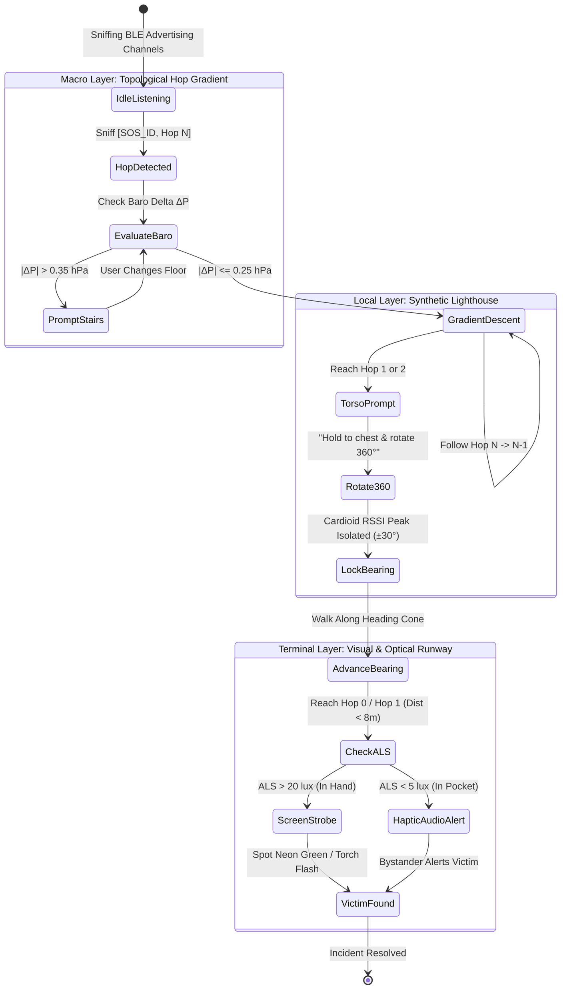

# 07. Rigorous Technical Critique & Mathematical Corrections

> [!CAUTION]
> **Executive Critique Summary:**
> The original notes contain profound operational intuition, but they suffer from **three critical mathematical and physical confusions**:
> 1. **Conflating Network Topology with Spatial Geometry:** Treating hop counts as distances and writing linear vector additions like $A \to B + B \to C = A \to C$ as if they were scalar sums.
> 2. **The Kabsch/Umeyama Trajectory Alignment Fallacy:** Assuming two independent walking humans can be aligned using rigid point-set registration without accounting for relative velocity vectors or range-only unobservability.
> 3. **The 28-Bit vs. Pose-Graph Contradiction:** Claiming the system can run distributed $SE(2)$ pose-graph SLAM with covariance propagation while simultaneously claiming the entire payload is 28 bits.
> 
> Below is the rigorous mathematical correction, error analysis, and structural additions required to make the architecture scientifically sound.

---

## 1. The Core Architectural Schism & Dual-Tier Resolution

```text
┌────────────────────────────────────────────────────────────────────────────────────────┐
│ THE UNRESOLVED SCHISM IN THE ORIGINAL NOTES:                                           │
│ "Is Crowd Compass a 28-bit Topological Hop Gradient, or a Full SE(2) Pose-Graph SLAM?"│
└────────────────────────────────────────────────────────────────────────────────────────┘
                                      │
                   ┌──────────────────┴──────────────────┐
                   ▼                                     ▼
┌──────────────────────────────────────┐┌────────────────────────────────────────────────┐
│ TIER 1: THE BROADCAST BEACON PLANE   ││ TIER 2: THE CO-PRESENCE CONTRACT PLANE         │
│ (The 32-Bit Emergency Wire Format)   ││ (The Asynchronous 48-Byte Pairwise SE(2) Graph)│
├──────────────────────────────────────┤├────────────────────────────────────────────────┤
│ • Transport: BLE Non-Connectable Adv ││ • Transport: BLE GATT / L2CAP Point-to-Point   │
│ • Payload: Exactly 4.0 Bytes (32b)   ││ • Payload: 48 Bytes (Compressed Subgraph Edge) │
│ • Topology: Shortest Path Hop Metric ││ • Geometry: SE(2) Rigid Body Transforms        │
│ • Scope: Venue-wide Flood Suppression││ • Scope: Local Encounters Between Moving Pairs │
│ • Solves: Macro Navigation (500m→15m)││ • Solves: Micro Drift & Social Group Mapping   │
└──────────────────────────────────────┘└────────────────────────────────────────────────┘
```

### The Inevitable Tradeoff
* **If an emergency occurs:** The responder needs immediate, low-latency, storm-proof macro guidance. They cannot wait for 50 phones to negotiate L2CAP connections and solve distributed non-linear least squares. **Tier 1 (Topological Hop Gradient)** is the sole viable broadcast plane.
* **If a private group wants a relative map:** Or when two phones walk together for 30 seconds, they use **Tier 2 (Pairwise $SE(2)$ Graph)** via local peer-to-peer handshakes.

---

## 2. Critique of Vector-Chain Composition: The $SE(2)$ Mathematical Correction

### The Fatal Flaw in the Original Plain-Language Formulation
The notes repeatedly suggest:
$$\text{Vector } A \to B + \text{Vector } B \to C = \text{Vector } A \to C$$
This is **strictly false** unless all devices share the exact same rotational orientation coordinate frame ($\theta_A = \theta_B = \theta_C$). In real crowds, every phone initializes an arbitrary local heading $\theta = 0$ based on whatever direction it was facing when turned on.

### The Correct Lie Group Formulation: $SE(2)$ Manifold
Each local phone pose must be modeled as an element of the Special Euclidean Group $SE(2)$:

$$\mathbf{T}_i = \begin{bmatrix} \mathbf{R}(\theta_i) & \mathbf{p}_i \\ \mathbf{0}^T & 1 \end{bmatrix} \in SE(2), \quad \mathbf{R}(\theta_i) = \begin{bmatrix} \cos \theta_i & -\sin \theta_i \\ \sin \theta_i & \cos \theta_i \end{bmatrix}, \quad \mathbf{p}_i = \begin{bmatrix} x_i \\ y_i \end{bmatrix}$$

#### Composition Law
The relative transform mapping Node $C$'s local frame into Node $A$'s local frame across intermediary $B$ is a **matrix multiplication**, not a vector addition:

$$\mathbf{T}_{A \leftarrow C} = \mathbf{T}_{A \leftarrow B} \cdot \mathbf{T}_{B \leftarrow C} = \begin{bmatrix} \mathbf{R}_{AB} \mathbf{R}_{BC} & \mathbf{R}_{AB} \mathbf{t}_{BC} + \mathbf{t}_{AB} \\ \mathbf{0}^T & 1 \end{bmatrix}$$

Where:
* $\mathbf{R}_{AC} = \mathbf{R}(\Delta\theta_{AB} + \Delta\theta_{BC})$
* $\mathbf{t}_{AC} = \mathbf{R}(\Delta\theta_{AB}) \mathbf{t}_{BC} + \mathbf{t}_{AB}$

#### Error Covariance Compounding (First-Order Propagation)
Let $\boldsymbol{\xi} = [\delta x, \delta y, \delta \theta]^T \in \mathfrak{se}(2)$ be the tangent error vector. The adjoint matrix $\operatorname{Adj}(\mathbf{T})$ rotates and translates the covariance:

$$\operatorname{Adj}(\mathbf{T}_{AB}) = \begin{bmatrix} \mathbf{R}_{AB} & \mathbf{J} \mathbf{t}_{AB} \\ \mathbf{0}^T & 1 \end{bmatrix}, \quad \text{where } \mathbf{J} = \begin{bmatrix} 0 & 1 \\ -1 & 0 \end{bmatrix}$$

$$\boldsymbol{\Sigma}_{AC} = \boldsymbol{\Sigma}_{AB} + \operatorname{Adj}(\mathbf{T}_{AB}) \cdot \boldsymbol{\Sigma}_{BC} \cdot \operatorname{Adj}(\mathbf{T}_{AB})^T$$

> [!WARNING]
> Notice the cross-coupling term $\mathbf{J} \mathbf{t}_{AB}$: **any rotational error in hop 1 ($\sigma_{\theta,1}^2$) scales with the squared translation distance of all subsequent hops $\|\mathbf{t}_{BC}\|^2$!**
> This is the mathematical reason why vector chaining without loop closures explodes quadratically.

---

## 3. Critique of the Kabsch/Umeyama Trajectory Alignment

The notes propose:
> *"When two devices meet, exchange recent PDR trajectories and use Kabsch algorithm to find $R, t$."*

### Why Kabsch Fails on Independent Humans
The Kabsch/Umeyama algorithm assumes **paired point correspondences of the identical rigid body**:
$$\mathbf{z}_k = \mathbf{R} \mathbf{p}_k + \mathbf{t} + \boldsymbol{\epsilon}_k$$
In an emergency crowd:
1. **Device A and Device B are on different bodies:** Device A is in Person A's right pocket; Device B is in Person B's hand.
2. Even if they are walking near each other, their physical trajectories $\mathbf{p}_A(t)$ and $\mathbf{p}_B(t)$ are **not identical**:
   $$\mathbf{p}_B(t) = \mathbf{p}_A(t) + \mathbf{d}_{AB}(t)$$
   Applying Kabsch directly forces the solver to treat the spatial gap between two people as measurement noise, producing distorted rotation estimates.

### Range-Only Unobservability & The Mirror Flip Ambiguity
Bluetooth RSSI does not measure point vectors $\mathbf{z}_k$; it measures scalar distance $d_k \in \mathbb{R}^+$.
Given two drifting trajectory segments $\mathbf{p}_A(t)$ and $\mathbf{p}_B(t)$, the range residual is:

$$r_k(\Delta\theta, \mathbf{t}) = \|\mathbf{p}_A(t_k) - (\mathbf{R}(\Delta\theta) \mathbf{p}_B(t_k) + \mathbf{t})\| - \hat{d}_k$$

#### The Rank-Deficiency Theorem
If both users walk along straight parallel lines with constant velocity:
$$\operatorname{rank}\left(\mathbf{J}^T \mathbf{J}\right) = 2 < 3$$
The system has **zero observability of rotation** and exhibits a continuous manifold of ambiguous solutions. Furthermore, range measurements are symmetric across the baseline: **the solver cannot determine whether Person B is walking on Person A's left or right side**.

### The Necessary Fix: Co-Motion Turning Constraints
To resolve the transform $\mathbf{T}_{AB}$ from range-only trajectories:
1. **Motion Non-Collinearity:** At least one user must execute an angular turn during the mutual sensing window:
   $$\int_{t_0}^{t_1} |\dot{\theta}(t)| dt > 35^\circ$$
2. **Heading Differential Prior:** The system must exchange coarse magnetometer headings to initialize the rotational optimization prior:
   $$\Delta\theta_0 = \theta_A^{\text{mag}} - \theta_B^{\text{mag}}, \quad \sigma_{\Delta\theta}^2 \approx \sigma_{\text{mag},A}^2 + \sigma_{\text{mag},B}^2$$

---

## 4. Critique of Hop-Count Gradient Field: Obstacle Shadows & Local Minima

While the Topological Gradient Field solves coordinate compounding, it introduces a subtle topological hazard: **The Non-Euclidean Obstacle Shadow**.

```text
       [Hop 0: SOS Target]
         │
    ═════════════════════════ Concrete Wall / Sound Stage Barricade
         │                 │
         │                 ▼  [Corridor Wrap-Around]
         │              [Hop 1]
         │                 │
    [Blocked Line]      [Hop 2]
         │                 │
         ▼                 ▼
   [Hop 4 Area] ◄──── [Hop 3]
         ▲
         │
   [Responder]
```

### The Problem
* The shortest RF path in the graph might require wrapping around a $150\text{-meter}$ stadium corridor ($0 \to 1 \to 2 \to 3 \to 4$).
* A responder standing at Hop 4 might be **physically 4 meters from the victim**, separated by an acoustic barrier or stage baffle!
* **The Danger:** A pure hop descent algorithm forces the medic to walk $150\text{ meters}$ around the barrier ($4 \to 3 \to 2 \to 1 \to 0$), unaware that the victim is literally on the other side of the partition.

### The Architectural Addition: Bimodal Proximity Override
To prevent responders from walking away from a partition when the victim is right behind it:
1. **The Hop-1 RF Bleed Detection:**
   If a responder at `Hop 4` detects a direct `Hop 0` packet (even with extremely weak RSSI, e.g. $-94\text{ dBm}$ leaking through a partition seam):
2. **The "Wall Alert" Heuristic:**
   $$\text{If } H_{\text{local}} \ge 3 \quad \text{AND} \quad \text{Direct Hop 0 sniffs} > 0:$$
   The UI immediately alerts:
   > **"CAUTION: VICTIM DETECTED BEHIND BARRIER / WALL. PHYSICAL DETOUR REQUIRED VIA HOP 3."**

---

## 5. Physical Modeling Additions: Antenna Detuning & Rician Fading

### 5.1 The Human Hand Loading Effect
The original notes discuss torso attenuation ($15\text{--}25\text{ dB}$).
However, in practical smartphone usage, **Hand Loading (Dielectric Detuning)** is equally destructive:
* When a user wraps their fingers around a smartphone, their hand covers the cellular/BLE ceramic antenna slits.
* **Measured Loss:** Hand grip introduces an immediate **$6\text{ to } 12\text{ dB}$ reduction in antenna radiation efficiency**, shifting the center resonance frequency away from $2.44\text{ GHz}$.
* **Orientation Loss:** A phone stored vertically in a pocket vs. held horizontally in a hand introduces an orthogonal polarization mismatch loss of $\sim 8\text{--}10\text{ dB}$.

### 5.2 Composite RF Channel Equation
The accurate path-loss model for Crowd Compass must account for multi-channel frequency diversity:

$$\operatorname{RSSI}_c(d) = P_{\text{tx}} - 10 n \log_{10}(d) - L_{\text{hand}} - L_{\text{torso}}(\phi) - X_{\text{Rician}}(K) - \Delta f_c$$

Where:
* $c \in \{37, 38, 39\}$ is the primary advertising channel.
* $\Delta f_c$ represents frequency-selective multipath nulls ($2402\text{ MHz}, 2426\text{ MHz}, 2480\text{ MHz}$).
* **Key Addition:** By rapidly interleaving packet scans across all three channels within $100\text{ ms}$, the receiver averages out frequency-selective nulls, recovering up to **$5\text{ dB}$ of signal stability**.

---

## 6. The Complete Mathematically Sound Navigation State Machine



---

## 7. Mathematical Additions Checklist for Production Code

To transition from conceptual notes to verified production implementation, the following concrete mathematical modules must be enforced:

1. **Lie Algebra Error Retraction in Pose Graphs:**
   $$\mathbf{e}_{ij} = \operatorname{Log}\left(\mathbf{T}_{ij}^{-1} \mathbf{T}_i^{-1} \mathbf{T}_j\right)$$
   Never use Cartesian subtraction for $SE(2)$ poses.
2. **Robust Cost Functions:**
   Replace standard squared residuals $\mathbf{e}^T \boldsymbol{\Omega} \mathbf{e}$ with the **Huber Loss Function**:
   $$\rho(e) = \begin{cases} \frac{1}{2} e^2 & \text{for } |e| \le \delta \\ \delta (|e| - \frac{1}{2}\delta) & \text{otherwise} \end{cases}$$
   To prevent multipath RSSI anomalies from destroying graph stability.
3. **Zero-Velocity Detection (ZUPT):**
   When the accelerometer norm variance satisfies $\operatorname{Var}(\|\mathbf{a}\|) < 0.02\text{ m}^2/\text{s}^4$ over $1.5\text{ seconds}$, lock velocity to zero, halt covariance inflation, and tag the device as a temporary high-trust structural pillar.
4. **Adaptive Trickle Jitter Scaling:**
   $$T_{\text{jitter\_max}} = T_{\min} \cdot \left(1 + \gamma \log_2(1 + \hat{N}_{\text{sniffed}})\right)$$
   Prevents broadcast storms in clusters exceeding 2,000 devices.
