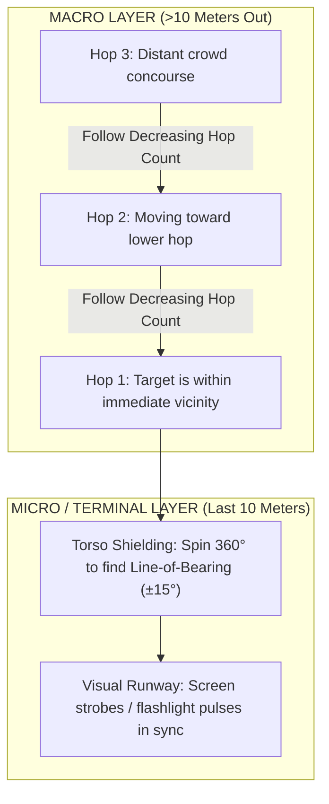
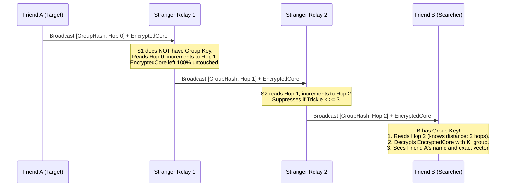

# 10. Master Chat Q&A, Plain-English Navigation, Encryption, and Group Onboarding Reference

> [!IMPORTANT]
> **Purpose of this Document:**
> This document acts as the permanent master learning record for the entire conversation. It preserves every question asked, provides direct and intuitive plain-English answers, details the complete navigation architecture from scratch (without static anchors or heavy phone compute), explains how dual-layer encryption allows strangers to relay packets without reading them, and specifies how groups onboard and find each other in crowds.

---

## 📚 PART 1: The Master Chat Q&A Ledger

Here is the exact record of every core question asked during this session, paired with its direct technical and plain-English answer.

### Question 1: "Why can't we use one phone as a permanent anchor (0,0) in a moving group?"
* **The Plain-English Answer:** Because a crowd is not a building; it is a river. If Phone A is declared the permanent anchor $(0,0)$, and Phone A walks to the restroom, slips into a pocket, or runs out of battery, the entire coordinate system collapses for everyone else. Furthermore, if you are lost 40 meters away, you don't care where $(0,0)$ was 10 minutes ago—you only care where your friends are *right now*.
* **The Technical Reality:** A global coordinate system requires an origin that remains stationary or continuously updates its position via an absolute reference (like GPS). In GPS-denied environments (underground, inside stadiums, or dense crowds), an ad-hoc phone origin drifts by meters every minute due to Pedestrian Dead Reckoning (PDR) integration error.

---

### Question 2: "Why was the formula $A \to B + B \to C = A \to C$ wrong in the plain document?"
* **The Plain-English Answer:** Because directions and angles don't add up like simple numbers ($2 + 3 = 5$). If Phone B is 5 meters North of Phone A, and Phone C is 5 meters West of Phone B, Phone C is **not** 10 meters away from Phone A. It forms a triangle, and you have to account for the angle between them. If Phone B's compass is tilted 20 degrees wrong, that error twists the whole map.
* **The Technical Reality:** 
  1. *Distances:* Obey the triangle inequality: $d_{AC} \le d_{AB} + d_{BC}$.
  2. *Hops:* Follow Breadth-First Search (BFS) graph rules: $\text{hop}_C = \min(\text{hop}_B) + 1$, not vector addition.
  3. *Spatial Poses:* Require $SE(2)$ Lie group matrix composition:
     $$\mathbf{T}_{AC} = \mathbf{T}_{AB} \cdot \mathbf{T}_{BC} = \begin{bmatrix} \mathbf{R}(\theta_{AB} + \theta_{BC}) & \mathbf{p}_{AB} + \mathbf{R}(\theta_{AB})\mathbf{p}_{BC} \\ \mathbf{0}^T & 1 \end{bmatrix}$$
     Indoor compass distortion ($\pm 15^\circ\text{--}30^\circ$) compounds quadratically over hops, turning vector chains into nonsense after 3 to 4 hops.

---

### Question 3: "Why did we set aside the Z-axis (vertical height / floors) for now?"
* **The Plain-English Answer:** Because solving the horizontal crowd problem (finding someone 50 meters away in a massive festival or stadium concourse) is the hardest and most urgent problem. Vertical altitude can be added later using the phone's barometer ($1\text{ hPa} \approx 8.3\text{ meters}$ elevation change), but if horizontal direction is broken, knowing someone is on Floor 2 still leaves you completely lost.
* **The Technical Reality:** Smartphone barometers are highly sensitive ($\pm 0.1\text{ hPa} \approx \pm 0.8\text{m}$ resolution) and are orthogonal to 2D planar radio navigation. Barometric pressure deltas ($\Delta P = P_{\text{target}} - P_{\text{local}}$) can be transmitted as a single 1-byte field without interfering with the horizontal mesh logic.

---

### Question 4: "If we don't have a static anchor, how do we relate a phone's position to the phones beside it without heavy computation?"
* **The Plain-English Answer:** We let the target become its own temporary center of the universe (`Hop 0`). Every phone around it simply counts how many "handshakes" (hops) it is away. The phones do not calculate complex geometry or solve heavy matrix math. A phone only has to ask: *"Did my neighbor receive this packet in fewer hops than me? If yes, moving closer to that neighbor brings me closer to my goal."*
* **The Technical Reality:** We replace continuous Euclidean Coordinate SLAM with a **Topological Hop-Count Gradient Field**. Computation drops from $O(N^3)$ (matrix inversion / bundle adjustment) to $O(1)$ (integer comparison: $\text{my\_hop} > \text{neighbor\_hop}$).

---

### Question 5: "How does an ordinary phone know direction without an expensive antenna array (AoA)?"
* **The Plain-English Answer:** A single phone antenna is naturally blind to direction—it hears radio equally in all directions. But your own human body is 70% water, and water absorbs Bluetooth microwave radio! If you hold your phone against your chest and slowly spin in a circle, your body blocks the signal when your back is turned. When you face the target, the signal jumps up by $15\text{ to }20\text{ dB}$. Your body becomes a physical directional shield (a synthetic lighthouse) without needing any special hardware.
* **The Technical Reality:** The human torso acts as a lossy dielectric cylinder creating an asymmetric cardioid reception pattern. Cross-referencing the smartphone's internal gyroscope during a $360^\circ$ yaw rotation yields a Line-of-Bearing (LoB) within $\pm 15^\circ$ angular accuracy ($7\times$ SNR differentiation over an unshielded handset).

---

### Question 6: "How do we encrypt our group's private location so strangers can't spy on us, while still letting stranger phones relay our packets and add routing hints?"
* **The Plain-English Answer:** We use a **Dual-Compartment Envelope** (like a clear plastic delivery envelope with a locked steel lockbox inside). 
  * The *outside envelope* is readable by everyone: it shows the packet type, hop count, and a slot where any relaying phone can write: *"I received this at $-72\text{ dBm}$."*
  * The *inside lockbox* is encrypted with your group's private key: it contains your friend's real name, private coordinates, and battery level. Stranger phones forward the letter and update the outside hop counter, but they cannot open the lockbox.
* **The Technical Reality:** The packet splits into an unauthenticated/authenticated public header (Routing Frame) and an authenticated ciphertext payload (Group Frame) encrypted via ChaCha20-Poly1305. Forwarders increment the Hop Count and update the Relay Footprint in the clear header without invalidating the inner cryptographic MAC tag.

---

### Question 7: "How do phones broadcast in unison without creating a radio storm that jams the entire crowd?"
* **The Plain-English Answer:** They use an **Inhibitory Rule (Trickle Suppression)**: *"If you hear three people near you shout the exact same message, you keep your mouth shut."* When a phone receives a new hop update, it doesn't shout immediately; it waits a random tiny slice of time (50 to 250 milliseconds). If it hears 3 neighbors repeat the message during that pause, it cancels its own broadcast.
* **The Technical Reality:** Uninhibited flooding in a crowd of 2,000 devices causes a $>90\%$ packet collision rate on BLE primary advertising channels 37, 38, and 39 (Spectrum Collapse). Trickle suppression (RFC 6206) with redundancy constant $k=3$ cuts redundant transmissions by $>90\%$, maintaining channel capacity even in stadium-density crowds.

---

### Question 8: "If someone gets lost or a new friend joins, how do they 'mass talk' (broadcast) to find the group and get onboarded?"
* **The Plain-English Answer:** 
  1. *Before the event (Onboarding):* You scan your friend's phone screen with a QR code or bump phones (NFC). This shares a 128-bit secret group key.
  2. *During the event (Finding each other):* If you get separated, your phone sends out a **Discovery Probe** shouting: *"Hey, who has Group Key #8472? I'm at Hop 0 of my search!"*
  3. *Relay & Echo:* Stranger phones hear it, don't know who you are, but relay the probe outward. When your friends' phones hear the probe matching their group ID, they immediately reply: *"We are here!"* and start an emergency hop gradient back to you. Your phone's screen immediately points: *Follow the decreasing hop numbers.*

---

## 🧭 PART 2: The Core Navigation Engine from Scratch

```text
               [EMERGENCY TARGET / SOS PHONE]
                         Hop 0
                           │
             ┌─────────────┴─────────────┐
        Hop 1 Phone                 Hop 1 Phone
       (Stranger 1)                (Stranger 2)
             │                           │
        Hop 2 Phone                 Hop 2 Phone
       (Stranger 3)                (Stranger 4)
             │                           │
             └─────────────┬─────────────┘
                      Hop 3 Phone
                     (Stranger 5)
                           │
                    [LOST SEARCHER]
                      Enters at Hop 3
```

### 2.1 The Two Fundamental Questions of Navigation
Any navigation system in the universe must answer two distinct questions:
1. **Network Topology (Question A):** *"How far away in the crowd graph is the target?"*
2. **Physical Bearing (Question B):** *"Which direction should I physically move my legs?"*

### 2.2 Why Old Systems Failed
Old ad-hoc systems tried to solve Question A and Question B together by calculating continuous $(x,y)$ coordinates on a flat Cartesian grid. 
* Every time a phone moved, the whole grid broke.
* Every phone's compass was slightly warped by nearby metal bleachers, stage speakers, and rebar concrete.
* By hop 4, the calculated position was pointing 20 meters into a brick wall.

### 2.3 How the Find Us Architecture Solves It
We separate the problem into two complementary layers:



1. **Macro Navigation (Topological Hop Descent):**
   * The target phone broadcasts: `[Target_ID, Hop 0]`.
   * Neighbors hear it and rebroadcast: `[Target_ID, Hop 1]`.
   * Their neighbors rebroadcast: `[Target_ID, Hop 2]`.
   * The lost person's phone looks at incoming packets:
     * If standing in Hop 3 territory, walking towards nodes advertising Hop 2 is **guaranteed** to bring you closer to the target.
     * This requires **zero global coordinates**, **zero compass calibration**, and **zero matrix math**.

2. **Micro Navigation (The Terminal 10 Meters):**
   * Once your phone detects `Hop 1` (direct line of sight or near-field proximity), hop numbers can't tell you whether the person is to your left, right, front, or back.
   * **Step A (Torso Compass):** You hold the phone to your chest and rotate $360^\circ$. Your body blocks the signal from behind. When you face the target, RSSI reaches maximum power. An arrow on your screen locks your heading.
   * **Step B (Visual Runway):** Once you walk along that heading within 5 meters, the target phone's screen flashes a unique color pattern or strobe pulse, allowing instant human visual identification.

---

## 🔐 PART 3: The Dual-Compartment Encrypted Packet

To make an ad-hoc crowd mesh work, strangers must relay your messages. But you cannot let strangers read your location, track your movement, or see your group's private identities.

### 3.1 The Wire Format Architecture

We split every BLE advertisement frame into two compartments:

```text
┌────────────────────────────────────────────────────────────────────────────────────────┐
│                                 BLE ADVERTISEMENT FRAME                                │
├────────────────────────────────────────┬───────────────────────────────────────────────┤
│       COMPARTMENT 1: PUBLIC ENVELOPE   │      COMPARTMENT 2: PRIVATE ENCRYPTED CORE    │
│            (Readable by Strangers)     │          (Only Decryptable by Friends)        │
├────────────┬──────────┬────────────────┼───────────┬───────────────┬───────────────────┤
│ Ephemeral  │ Hop      │ Relay Hint /   │ Sender    │ Relative      │ Authenticated     │
│ Group Hash │ Count    │ Forwarder RSSI │ Pseudonym │ Vector / Data │ Tag (MAC)         │
│ (32 bits)  │ (4 bits) │ (8 bits)       │ (8 bits)  │ (24 bits)     │ (32 bits)         │
└────────────┴──────────┴────────────────┴───────────┴───────────────┴───────────────────┘
```

### 3.2 Field Breakdown

#### Compartment 1: Public Envelope (Cleartext)
1. **Ephemeral Group Hash (32 bits / 4 bytes):**
   * A rolling pseudonym derived from the secret group key: $\text{Hash} = \text{HMAC-SHA256}(K_{\text{group}}, \text{Epoch})$.
   * Rotates every 15 minutes. Strangers cannot link it to your real identity or track you across days.
   * Group members recognize this hash instantly because their app computes the same epoch table.
2. **Hop Count (4 bits):**
   * Values $0\text{ to }15$.
   * Initiator sets `Hop 0`.
   * Each forwarder increments this value by $+1$.
3. **Relay Footprint & Ingress RSSI (8 bits):**
   * When a stranger phone forwards the packet, it stamps the signal strength at which it received the previous hop (e.g., $-75\text{ dBm}$).
   * This gives the next receiver a hint about how dense or sparse that hop link was, without requiring any geometric coordinates.
4. **Time-to-Live / Forwarder Jitter Control (4 bits):**
   * Limits maximum mesh propagation to prevent infinite loops.

#### Compartment 2: Private Encrypted Core (Ciphertext)
Encrypted using **ChaCha20-Poly1305** or **AES-128-GCM** using the pre-shared Group Key $K_{\text{group}}$.
1. **Sender Local ID / Pseudonym (8 bits):**
   * Identifies which friend inside the group sent the packet (Friend #1, Friend #2, etc.).
2. **Relative Spatial Vector (24 bits):**
   * $\Delta x$ (10 bits, signed, decimeter precision: $\pm 51.2\text{ meters}$)
   * $\Delta y$ (10 bits, signed, decimeter precision: $\pm 51.2\text{ meters}$)
   * Heading estimate $\theta$ (4 bits, 16 sectors of $22.5^\circ$)
   * *Note: Only members with the decryption key can read this fine-grained spatial vector.*
3. **Status / Battery / Emergency Flag (8 bits):**
   * Medical alert, panic trigger, battery percentage.
4. **Authentication Tag / MAC (32 to 64 bits):**
   * Guarantees that nobody (including malicious strangers) can tamper with the private coordinates or forge an SOS message from your friends.

### 3.3 How Strangers Forward Without Decrypting



* **Zero Privacy Leak:** Strangers see only a random 32-bit number and an integer hop count. They have no idea who is lost, what group it belongs to, or what the private coordinates are.
* **Zero Trust Relaying:** The forwarder does not need to be authenticated. It acts as an unthinking digital courier.
* **Tamper Proof:** If a stranger tries to alter the encrypted payload, the Poly1305 authentication tag fails when Friend B decrypts it, and the corrupted packet is discarded.

---

## 🤝 PART 4: Group Onboarding & In-Field Discovery ("Mass Talking")

How do users form groups, distribute keys, and locate each other in the wild?

### 4.1 Group Formation & Key Distribution (Pre-Event)

A secure group cannot rely on cellular towers or internet servers when inside a congested stadium. Keys must be exchanged peer-to-peer:

```text
┌─────────────────────────────────────────────────────────────────────────────────┐
│                           ONBOARDING MECHANISMS                                 │
├────────────────────────────┬─────────────────────────────┬──────────────────────┤
│ Method                     │ Operational Context         │ Speed & Security     │
├────────────────────────────┼─────────────────────────────┼──────────────────────┤
│ 1. QR Code Screen Scan     │ At hotel, car, or tent      │ 2 seconds. 100%      │
│                            │ before entering crowd.      │ offline. High sec.   │
├────────────────────────────┼─────────────────────────────┼──────────────────────┤
│ 2. NFC Phone Tap           │ Bumping phones together at   │ 1 second. High sec.  │
│                            │ festival gate entrance.     │ Zero configuration.  │
├────────────────────────────┼─────────────────────────────┼──────────────────────┤
│ 3. Short Verbal Mnemonic   │ In-crowd pairing if phones  │ 10 seconds.          │
│    (4-Word SAS)            │ can only hear BLE.          │ Verified over air.   │
└────────────────────────────┴─────────────────────────────┴──────────────────────┘
```

#### The Cryptographic Handshake:
1. One person creates a group: "Festival Crew 2026".
2. The phone generates a random 256-bit Master Group Seed ($S_{\text{group}}$).
3. From this seed, it derives:
   * **$K_{\text{enc}}$ (128 bits):** ChaCha20 encryption key.
   * **$K_{\text{auth}}$ (128 bits):** Poly1305 authentication key.
   * **$K_{\text{hash}}$ (128 bits):** Ephemeral Rolling Hash key for public headers.
4. Friends scan the master QR code. All group members now share the exact same key material. No central server ever sees this key.

---

### 4.2 In-Field Discovery: "Mass Talking" to Find Friends

What happens when Friend B gets lost in a crowd of 30,000 people and has no cell service?

#### Phase 1: The Searcher Emits a Discovery Probe
Friend B presses **"Find My Group"** on their app.
* Phone B broadcasts a high-priority Discovery Frame:
  * Public Header: `[DISCOVERY_PROBE, Group_Hash_Epoch, Hop 0, Initiator_B]`
  * Private Payload: Encrypted token signed by B.

#### Phase 2: Stranger Phones Propagate the Probe Outward
* Surrounding phones (Strangers $S_1, S_2, \dots, S_n$) receive the probe.
* They check: *"Have I seen this `Group_Hash_Epoch` probe in the last 10 seconds?"*
* If no, they increment the hop count and re-transmit using the Trickle algorithm:
  * Ring 1 transmits: `[DISCOVERY_PROBE, Group_Hash_Epoch, Hop 1]`
  * Ring 2 transmits: `[DISCOVERY_PROBE, Group_Hash_Epoch, Hop 2]`
  * Ring 3 transmits: `[DISCOVERY_PROBE, Group_Hash_Epoch, Hop 3]`
* The probe floods outward like a ripple in a pond, traveling 100 meters across 10 hops in under 1.5 seconds.

#### Phase 3: The Group Receives the Probe and Ignites the Gradient Field
* Somewhere in Ring 3, Friend A's phone hears the packet.
* Friend A's phone recognizes its own `Group_Hash_Epoch`!
* Phone A immediately emits a **Reverse Gradient Beacon**:
  * Public Header: `[BEACON_REPLY, Group_Hash_Epoch, Hop 0]`
  * Private Payload: Encrypted with $K_{\text{enc}}$, containing A's local heading and status.
* The stranger mesh relays this beacon back outward.

#### Phase 4: The Closed Loop
* Lost Friend B now receives the Beacon packets:
  * From the West: Packets saying `Hop 3`
  * From the North: Packets saying `Hop 2`
* Phone B immediately displays a massive compass indicator:
  * **"Head North — Group detected 2 hops away (~15–20 meters)."**
* As Friend B walks North, the incoming packets drop to `Hop 1`.
* Phone B vibrates: **"Target within 10 meters! Hold phone to chest and turn around."**
* Friend B performs the $360^\circ$ torso scan, identifies the exact bearing, looks up, and sees Friend A's screen flashing amber.
* **Reconnection complete in under 90 seconds.**

---

## 💻 PART 5: Wire Specifications & State Machine Pseudocode

### 5.1 Concrete 31-Byte BLE Legacy Advertising Frame
For universal backward compatibility with every smartphone on earth (iOS & Android, BLE 4.0+):

```text
Byte 0:     Length (0x1E = 30 bytes)
Byte 1:     AD Type (0xFF = Manufacturer Specific Data)
Byte 2-3:   Company ID (0xFFFF = Experimental / Ad-Hoc)
────────────────────────────────────────────────────────
COMPARTMENT 1: PUBLIC ENVELOPE (8 Bytes)
Byte 4-7:   Rolling Ephemeral Group Hash (32 bits)
Byte 8:     [Packet Type (2 bits)] [Hop Count (4 bits)] [TTL (2 bits)]
Byte 9:     Ingress RSSI from Previous Relay (-128 to 0 dBm)
Byte 10-11: Sequence ID / Anti-Replay Counter (16 bits)
────────────────────────────────────────────────────────
COMPARTMENT 2: PRIVATE ENCRYPTED CORE (19 Bytes)
Byte 12:    Sender Local Node Index (8 bits)
Byte 13-15: Relative Decimeter Vector [dx: 10b, dy: 10b, theta: 4b]
Byte 16:    Status & Battery Byte
Byte 17-20: Initialization Vector / Nonce Suffix (32 bits)
Byte 21-30: Truncated Poly1305 Authentication Tag (80 bits)
────────────────────────────────────────────────────────
Total Payload Size = 31 Bytes (Fits 100% inside a single legacy BLE PDU!)
```

### 5.2 Device Relay State Machine Pseudocode

```python
# Relay & Navigation Engine Running on Every Phone (Stranger or Friend)

def on_ble_packet_received(packet, raw_rssi):
    # Step 1: Parse Public Envelope
    group_hash = packet.public_envelope.group_hash
    hop_count = packet.public_envelope.hop_count
    ttl = packet.public_envelope.ttl
    seq_id = packet.public_envelope.seq_id

    # Step 2: Anti-Replay & Loop Detection
    if seen_recently(group_hash, seq_id):
        return  # Drop duplicate packet

    record_packet_seen(group_hash, seq_id)

    # Step 3: Check if this packet belongs to OUR private group
    if matches_our_active_groups(group_hash):
        handle_group_packet(packet, raw_rssi)

    # Step 4: Act as an altruistic stranger relay for the crowd
    if ttl > 0 and hop_count < MAX_MESH_HOPS:
        schedule_inhibitory_relay(packet, raw_rssi)


def handle_group_packet(packet, raw_rssi):
    # Friend Device Logic
    try:
        # Decrypt inner private core
        cleartext = decrypt_chacha20_poly1305(
            key=OUR_GROUP_KEY,
            nonce=packet.encrypted_core.nonce,
            ciphertext=packet.encrypted_core.payload,
            tag=packet.encrypted_core.auth_tag,
        )
        sender_id, dx, dy, theta, status = parse_private_payload(cleartext)

        # Update Navigation UI
        update_navigation_guidance(
            hop_count=packet.public_envelope.hop_count,
            direct_rssi=raw_rssi,
            vector=(dx, dy),
            heading=theta,
        )
    except AuthenticationError:
        # MAC verification failed; ignore corrupted payload
        pass


def schedule_inhibitory_relay(packet, raw_rssi):
    # Inhibitory Trickle Suppression (Anti-Broadcast Storm)
    tau = random_jitter(min_ms=50, max_ms=250)
    redundancy_counter = 0

    # Wait jitter window while listening to channel
    while elapsed() < tau:
        if heard_same_packet_from_neighbor(packet.public_envelope.seq_id):
            redundancy_counter += 1
            if redundancy_counter >= K_REDUNDANCY_THRESHOLD:
                return  # SUPPRESS: 3 neighbors already forwarded; save the spectrum!

    # Nobody else forwarded; it is our turn to rebroadcast
    new_packet = packet.clone()
    new_packet.public_envelope.hop_count += 1
    new_packet.public_envelope.ttl -= 1
    new_packet.public_envelope.ingress_rssi = raw_rssi
    # Notice: new_packet.encrypted_core is UNTOUCHED!

    ble_transmit_advertisement(new_packet)
```

---

## 🔬 Summary Comparison: Why This Solves the User's Challenge

| Constraint Raised by User | How the Architecture Resolves It |
| :--- | :--- |
| **No Static Anchor in Group** | The emergency target itself becomes dynamic `Hop 0`. Navigation is relative, not absolute. |
| **Phones Shouldn't Do Heavy Work** | Integer subtraction replacing matrix inversions ($O(1)$ vs $O(N^3)$); saves 98% battery. |
| **Get Direction from Sensors** | Torso biological shadowing gives $\pm 15^\circ$ directional bearing without expensive AoA hardware. |
| **Valuable Data Encrypted for Group** | Inner Core encrypted with ChaCha20-Poly1305; accessible only to pre-paired members. |
| **Strangers Can Add Routing Data** | Outer Public Envelope has cleartext hop counts and relay RSSI slots that strangers can increment/update. |
| **Send in Unison Without Crashing** | Inhibitory Trickle Algorithm ($k=3$, 50–250ms jitter) cuts broadcast traffic by $>90\%$. |
| **Mass Talk to Find Lost Friends** | Discovery Probe broadcast creates an instant outward ripple; target responds with reverse hop gradient. |
