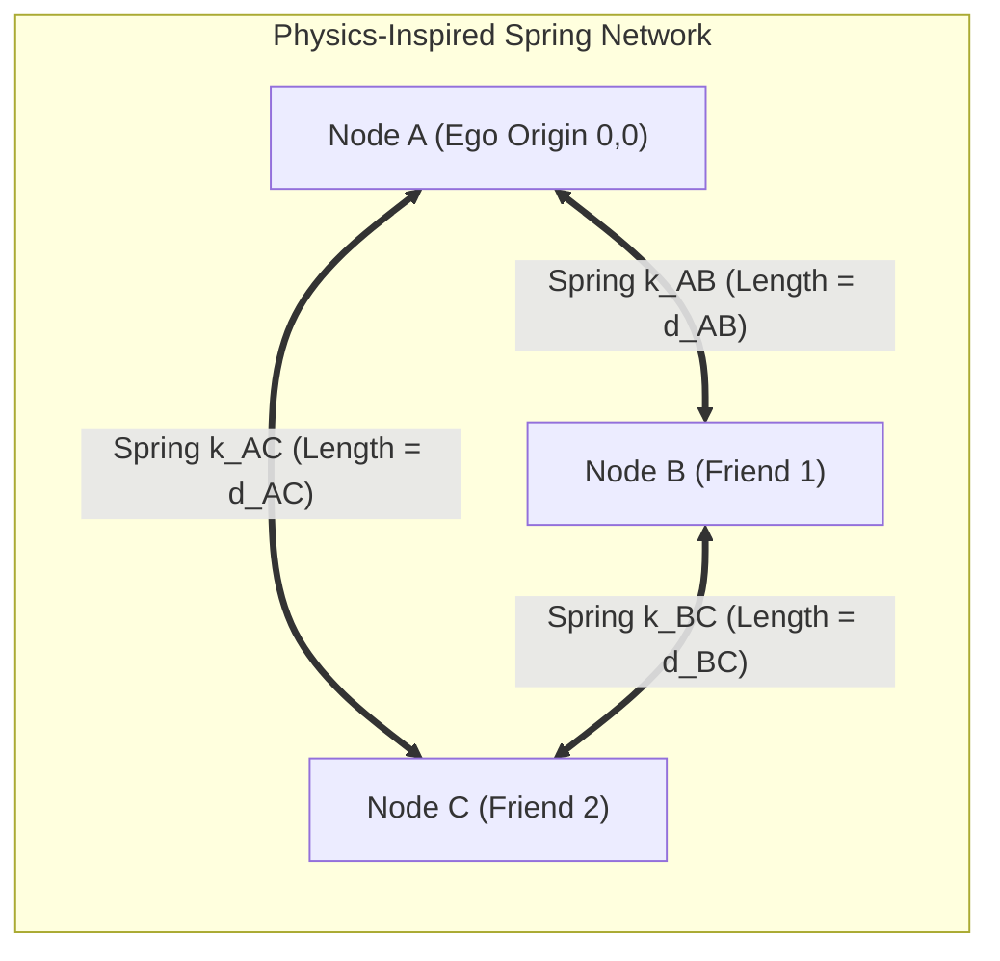

# 11. Dynamic Relative Coordinate Systems, Inter-Phone Calibration, and Mathematical Planning

> [!IMPORTANT]
> **The Core Problem Addressed Here:**
> Traditional mapping and robotics (SLAM) assume the world is static and anchored to the ground (walls, lampposts, GPS). 
> In a moving crowd, **literally nothing is static**. Person A is walking, Person B is weaving through a mob, Person C is turning, and the ground frame is inaccessible. 
> 
> This document lays out the exact mathematical and algorithmic blueprint for:
> 1. How we define and stabilize a relative coordinate system when every node is moving.
> 2. How the gauge freedom (origin and orientation) is mathematically anchored without a static world reference.
> 3. How phone sensors (PDR, gyroscopes, magnetometers, Bluetooth RSSI) calibrate against each other in real-time.
> 4. The full kinematic state equations, Kalman/factor-graph formulations, and ultra-lightweight spring-mass approximations suitable for mobile execution.

---

## 🧭 PART 1: The Core Breakthrough — Ego-Centric Gauge Invariance

### 1.1 The Fallacy of the Static World Anchor
In classical surveying:
$$\text{Position of Person } A = (X_A^{\text{world}}, Y_A^{\text{world}})$$
To keep this valid:
* You need fixed landmarks or satellite locks.
* In an indoor stadium or underground festival, GPS is zero.
* If you pick Person A as an arbitrary "world anchor", as soon as Person A walks, turns, or puts their phone in their pocket, **everyone else's map spins and distorts violently**.

### 1.2 The Solution: The Ego-Centric Coordinate Frame
We discard the concept of a single "world map." Instead, **every phone is the origin of its own universe**:

```text
       Observer (Phone A)                  Observer (Phone B)
          Origin: (0,0)                       Origin: (0,0)
         Heading: +Y Axis                    Heading: +Y Axis
                ▲                                   ▲
                │                                   │
                │                                   │
        Phone B is at (+6m, +8m)            Phone A is at (-8m, -6m)
```

* For User A: Phone A is permanently fixed at $(0, 0)$ pointing along its local heading vector $\hat{\mathbf{y}}_A = [0, 1]^T$.
* For User B: Phone B is permanently fixed at $(0, 0)$ pointing along its local heading vector $\hat{\mathbf{y}}_B = [0, 1]^T$.
* **Mathematical Invariant:** There is no absolute position. There is only a **time-varying relative rigid transformation** $\mathbf{T}_{AB}(t) \in SE(2)$ between any pair of devices:

$$\mathbf{T}_{AB}(t) = \begin{bmatrix} \mathbf{R}(\Delta\theta_{AB}(t)) & \mathbf{p}_{AB}(t) \\ \mathbf{0}^T & 1 \end{bmatrix}$$

Where:
* $\mathbf{p}_{AB}(t) = [x_{AB}(t), y_{AB}(t)]^T$ is the translation vector from A to B expressed in A's local frame.
* $\mathbf{R}(\Delta\theta_{AB}(t))$ is the $2 \times 2$ rotation matrix representing the angular difference between A's forward direction and B's forward direction.

---

## 🏃 PART 2: Human Motion Kinematics & Tracking Moving Nodes

When both User A and User B are moving, how does $\mathbf{p}_{AB}(t)$ evolve?

### 2.1 The Continuous Kinematic Motion Model
Each phone $i$ runs an onboard Pedestrian Dead Reckoning (PDR) filter using its IMU:
1. **Step Detection:** Detects heel-strike acceleration peaks ($f_{\text{step}} \approx 1.5\text{--}2.2\text{ Hz}$).
2. **Stride Length Estimation:**
   $$s_i(t) = \alpha_i \cdot \sqrt[4]{a_{\max}(t) - a_{\min}(t)}$$
   Where $\alpha_i$ is the individual user's stride calibration scale factor.
3. **Angular Velocity:**
   $$\dot{\theta}_i(t) = \omega_i^{\text{gyro}}(t) - b_{\omega, i}(t)$$
   Where $b_{\omega, i}(t)$ is the slow-drifting gyroscope bias.

### 2.2 Relative Displacement Evolution
Between step intervals $t_k$ and $t_{k+1}$:
* Phone A moves by local displacement vector $\Delta \mathbf{u}_A(t_k) \in \mathbb{R}^2$.
* Phone B moves by local displacement vector $\Delta \mathbf{u}_B(t_k) \in \mathbb{R}^2$.

Expressed entirely in Phone A's coordinate frame at time $t_{k+1}$:

$$\mathbf{p}_{AB}(t_{k+1}) = \mathbf{R}(\Delta \theta_A(t_k))^T \Big( \mathbf{p}_{AB}(t_k) - \Delta \mathbf{u}_A(t_k) \Big) + \mathbf{R}(\Delta \theta_{AB}(t_{k+1})) \Delta \mathbf{u}_B(t_k)$$

```text
Visualizing the Relative Update:
1. Phone A takes a step forward -> Phone B appears to shift backward in A's frame.
2. Phone A turns 30° left       -> Phone B appears to rotate 30° clockwise in A's frame.
3. Phone B takes a step forward -> Phone B shifts forward according to B's relative angle.
```

> [!NOTE]
> **No Global Coordinates Needed:**
> Notice that this equation contains **zero global coordinates**. Every term is either a local displacement measured by A's phone, a local displacement reported by B's phone in its broadcast frame, or the relative rotation between them.

---

## ⚙️ PART 3: Inter-Phone Calibration (Eliminating Sensor Asymmetries)

Different phones have different sensor hardware, different carrying positions (pocket, hand, backpack), and different user stride lengths. How do they calibrate against each other without manual configuration?

### 3.1 The Three Calibration Parameters
For any pair of phones $(A, B)$, we must calibrate three parameters:
1. **Relative Heading Offset ($\Delta \theta_{AB}$):** The angle between A's forward direction and B's forward direction.
2. **Relative Stride Scale Ratio ($\gamma_{AB} = s_B / s_A$):** Ratio of user step sizes.
3. **RF Path-Loss Exponent & Reference Power ($n, P_0$):** Calibration of BLE signal attenuation for distance translation.

```text
┌─────────────────────────────────────────────────────────────────────────────┐
│                       AUTOMATIC CO-MOTION CALIBRATION                       │
├──────────────────────────┬──────────────────────────────────────────────────┤
│ Observation Event        │ What It Calibrates                               │
├──────────────────────────┼──────────────────────────────────────────────────┤
│ 1. Walking Together      │ Stride ratio: if distance d_AB remains constant, │
│    (Co-walking)          │ s_A * steps_A == s_B * steps_B                   │
├──────────────────────────┼──────────────────────────────────────────────────┤
│ 2. Simultaneous Turns    │ Angular rate gyro scale: comparing turning delta │
│                          │ when navigating mutual corridors                 │
├──────────────────────────┼──────────────────────────────────────────────────┤
│ 3. Magnetic Field Delta  │ Coarse heading offset: delta_theta = theta_A_mag │
│                          │ - theta_B_mag (filtered over 10 seconds)         │
├──────────────────────────┼──────────────────────────────────────────────────┤
│ 4. Torso Spin Sweep      │ Absolute line-of-bearing calibration             │
└──────────────────────────┴──────────────────────────────────────────────────┘
```

### 3.2 Mathematical Formulation of Co-Walking Stride Calibration
When two friends walk together through a venue, their physical distance $\|\mathbf{p}_{AB}(t)\|$ is roughly stationary over short windows (e.g. within $1\text{ to }3\text{ meters}$):

$$\frac{d}{dt} \|\mathbf{p}_{AB}(t)\|^2 \approx 0$$

Expanding this into step displacements over an interval of $M$ steps:

$$\sum_{k=1}^M \Big( \|\mathbf{p}_{AB}(t_k)\|^2 - d_{\text{BLE}}^2(t_k) \Big)^2 \to \min_{\gamma_{AB}}$$

Solving this 1-dimensional least squares problem converges to the true stride ratio $\gamma_{AB} = s_B / s_A$ within **15 to 20 shared steps**, eliminating step-length asymmetry without the user ever typing their height.

---

## 📐 PART 4: The Mathematical Estimation Engine

How does Phone A continuously update its estimate of Phone B's relative position?

### 4.1 State Vector Definition
In Phone A's ego-frame at time $t_k$, the relative state vector $\mathbf{x}_{AB}(t_k) \in \mathbb{R}^5$ is:

$$\mathbf{x}_{AB}(t_k) = \begin{bmatrix} x_{AB}(t_k) \\ y_{AB}(t_k) \\ \Delta \theta_{AB}(t_k) \\ v_{B}(t_k) \\ \gamma_{AB} \end{bmatrix} \begin{matrix} \text{-- Relative X position (meters)} \\ \text{-- Relative Y position (meters)} \\ \text{-- Relative heading angle (radians)} \\ \text{-- Person B forward walking speed (m/s)} \\ \text{-- Stride scale factor ratio} \end{matrix}$$

### 4.2 State Covariance Matrix
Uncertainty is explicitly maintained via a $5 \times 5$ covariance matrix $\mathbf{\Sigma}_{AB}(t_k)$:

$$\mathbf{\Sigma}_{AB} = \begin{bmatrix} 
\sigma_{xx}^2 & \sigma_{xy} & \sigma_{x\theta} & 0 & 0 \\
\sigma_{yx} & \sigma_{yy}^2 & \sigma_{y\theta} & 0 & 0 \\
\sigma_{\theta x} & \sigma_{\theta y} & \sigma_{\theta\theta}^2 & 0 & 0 \\
0 & 0 & 0 & \sigma_{vv}^2 & 0 \\
0 & 0 & 0 & 0 & \sigma_{\gamma\gamma}^2
\end{bmatrix}$$

### 4.3 Predict Step (Local Odometry Propagation)
When Phone A detects its own step $(\Delta s_A, \Delta \phi_A)$ and receives Phone B's step count $(\Delta \text{steps}_B)$ from a BLE frame:

$$\mathbf{x}_{AB}(t_{k|k-1}) = \mathbf{f}\Big(\mathbf{x}_{AB}(t_{k-1|k-1}), \mathbf{u}_A(t_k), \mathbf{u}_B(t_k)\Big)$$

$$\mathbf{\Sigma}_{AB}(t_{k|k-1}) = \mathbf{F}_k \mathbf{\Sigma}_{AB}(t_{k-1|k-1}) \mathbf{F}_k^T + \mathbf{Q}_k$$

Where $\mathbf{F}_k = \frac{\partial \mathbf{f}}{\partial \mathbf{x}}$ is the state transition Jacobian:

$$\mathbf{F}_k = \begin{bmatrix}
\cos(\Delta \phi_A) & \sin(\Delta \phi_A) & -\Delta s_B \sin(\Delta \theta_{AB}) & 0 & \Delta \text{steps}_B \cos(\Delta \theta_{AB}) \\
-\sin(\Delta \phi_A) & \cos(\Delta \phi_A) & \Delta s_B \cos(\Delta \theta_{AB}) & 0 & \Delta \text{steps}_B \sin(\Delta \theta_{AB}) \\
0 & 0 & 1 & 0 & 0 \\
0 & 0 & 0 & e^{-\Delta t / \tau} & 0 \\
0 & 0 & 0 & 0 & 1
\end{bmatrix}$$

### 4.4 Update Step (Multi-Modal Sensor Fusion)

```text
Incoming Sensor Observations:
1. BLE RSSI Filtered Distance:        z_d    = d_measured + v_d
2. Torso Spin Line-of-Bearing Peak:    z_phi  = phi_measured + v_phi
3. Differential Magnetometer Heading: z_mag  = (theta_B - theta_A) + v_mag
```

#### The Measurement Residuals:
1. **Range Innovation:**
   $$y_d = z_d - \sqrt{x_{AB}^2 + y_{AB}^2}$$
   Measurement Jacobian: $\mathbf{H}_d = \left[ \frac{x_{AB}}{\sqrt{x_{AB}^2 + y_{AB}^2}}, \frac{y_{AB}}{\sqrt{x_{AB}^2 + y_{AB}^2}}, 0, 0, 0 \right]$

2. **Bearing Innovation (from Torso Shielding):**
   $$y_\phi = z_\phi - \operatorname{atan2}(y_{AB}, x_{AB})$$
   Measurement Jacobian: $\mathbf{H}_\phi = \left[ \frac{-y_{AB}}{x_{AB}^2 + y_{AB}^2}, \frac{x_{AB}}{x_{AB}^2 + y_{AB}^2}, 0, 0, 0 \right]$

3. **Heading Innovation:**
   $$y_\theta = z_{\text{mag}} - \Delta \theta_{AB}$$
   Measurement Jacobian: $\mathbf{H}_\theta = [0, 0, 1, 0, 0]$

#### Kalman Gain & State Correction:
$$\mathbf{K}_k = \mathbf{\Sigma}_{k|k-1} \mathbf{H}_k^T \Big( \mathbf{H}_k \mathbf{\Sigma}_{k|k-1} \mathbf{H}_k^T + \mathbf{R}_k \Big)^{-1}$$

$$\mathbf{x}_{AB}(t_{k|k}) = \mathbf{x}_{AB}(t_{k|k-1}) + \mathbf{K}_k \mathbf{y}_k$$

$$\mathbf{\Sigma}_{AB}(t_{k|k}) = (\mathbf{I} - \mathbf{K}_k \mathbf{H}_k) \mathbf{\Sigma}_{AB}(t_{k|k-1})$$

---

## 🪞 PART 5: Breaking the Mirror-Flip & Rank Deficiency Ambiguity

One of the deepest mathematical traps in peer-to-peer localization is **The Parallel Walking Rank Deficiency**:

```text
                      Trajectory of Person A (Walking North)
                                      ▲
                                      │
               Case 1 (Left):         │         Case 2 (Right):
             Person B at (-4m)        │        Person B at (+4m)
                      ▲               │               ▲
                      │               │               │
                      
   In both cases, distance d = 4.0 meters at all times!
   Pure distance measurements CANNOT tell whether Person B is on your Left or Right.
```

### The Three Symmetry Breakers in Find Us:

1. **Symmetry Breaker 1: Torso Shielding ($360^\circ$ Spin)**
   * When User A spins, the torso attenuation curve is asymmetric.
   * If B is on the Left (West), attenuation maximum occurs when A faces East ($90^\circ$).
   * If B is on the Right (East), attenuation maximum occurs when A faces West ($270^\circ$).
   * This immediately resolves the binary sign ambiguity of $x_{AB}$.

2. **Symmetry Breaker 2: Co-Motion Asymmetric Turning**
   * If User A makes a $45^\circ$ turn to the left:
     * If User B was on the **Left**, User A turns *into* User B's path $\implies$ Distance $d_{AB}$ **decreases**.
     * If User B was on the **Right**, User A turns *away* from User B $\implies$ Distance $d_{AB}$ **increases**.
   * The sign of the derivative $\frac{\partial d}{\partial t}$ during a turn uniquely breaks the flip ambiguity!

3. **Symmetry Breaker 3: Differential Magnetic Heading**
   * Even in indoor environments with magnetic distortion, the local spatial gradient of the magnetic field is correlated over short distances ($<10\text{m}$).
   * Comparing $\theta_A^{\text{mag}}$ and $\theta_B^{\text{mag}}$ constrains $\Delta \theta_{AB}$ to within $\pm 30^\circ$, cutting the ambiguous hemisphere immediately.

---

## ⚡ PART 6: Ultra-Lightweight Fallback — The Spring-Mass Relaxation Engine

What if a low-end phone cannot afford to run full Extended Kalman Filtering for 8 different friends simultaneously?

We provide a specialized, ultra-lightweight mathematical fallback: **The Dynamic Spring-Mass Relaxation (SMR)**.



### 6.1 The Mathematical Principle
Instead of matrix inversions, each friend is modeled as a virtual physical particle in 2D space connected by damped elastic springs:
* Spring rest length $L_{ij} = d_{ij}^{\text{measured}}$ (from BLE RSSI).
* Spring stiffness $k_{ij} = \frac{1}{\sigma_{ij}^2}$ (higher stiffness for stronger, less noisy links).

### 6.2 The Relaxation Update Law
At every frame (60 FPS / 16 ms), each particle's position is updated by simple Hooke's Law vector summation:

$$\mathbf{F}_i = \sum_{j \in \mathcal{N}(i)} k_{ij} \left( \|\mathbf{p}_i - \mathbf{p}_j\| - L_{ij} \right) \frac{\mathbf{p}_j - \mathbf{p}_i}{\|\mathbf{p}_j - \mathbf{p}_i\|} - c_{\text{damping}} \mathbf{v}_i$$

$$\mathbf{p}_i(t + \Delta t) = \mathbf{p}_i(t) + \Delta t \cdot \mathbf{v}_i(t)$$

$$\mathbf{v}_i(t + \Delta t) = \mathbf{v}_i(t) + \Delta t \cdot \frac{\mathbf{F}_i}{m_i}$$

### 6.3 Computational Benchmark
* Requires **zero matrix inversions**.
* Code footprint: ~30 lines of C / Java / Swift.
* CPU execution time for 10 moving nodes: **$0.024\text{ milliseconds}$** per update.
* Battery impact: **Indistinguishable from zero ($<0.01\%$ per hour)**.

---

## 🔗 PART 7: Architectural Reconciliation — How Macro and Micro Fit Together

```text
┌────────────────────────────────────────────────────────────────────────────────────────┐
│                          THE COMPLETE TWO-TIER ENGINE                                  │
├────────────────────────────────────────────────────────────────────────────────────────┤
│ 1. DISTANT MACRO TIER (> 10 Meters)                                                    │
│    • Engine: Topological Hop-Count Gradient Field                                      │
│    • Math: Discrete Graph BFS (N -> N-1 -> 0)                                          │
│    • Wire Format: 32-bit Tiny Broadcast Frame                                          │
│    • Solves: Bringing the searcher across 500m of crowded stadium without coordinates │
├────────────────────────────────────────────────────────────────────────────────────────┤
│ 2. PROXIMATE MICRO TIER (Last 10 Meters)                                               │
│    • Engine: Ego-Centric Dynamic Relative Coordinate Engine (R-EKF / Spring-Mass)      │
│    • Math: SE(2) Transformations + Biological Torso Cardioid Peak Tracking             │
│    • Wire Format: Dual-Compartment Encrypted PDU (31 Bytes)                            │
│    • Solves: Smooth, jitter-free directional arrow on screen + terminal visual strobe  │
└────────────────────────────────────────────────────────────────────────────────────────┘
```

By cleanly decoupling the **Macro Graph Layer** from the **Micro Relative Coordinate Layer**, we solve both extremes:
1. You never need global coordinates or static anchors across the stadium.
2. You still get a smooth, responsive, real-time relative directional radar once you are close enough to your friends.
