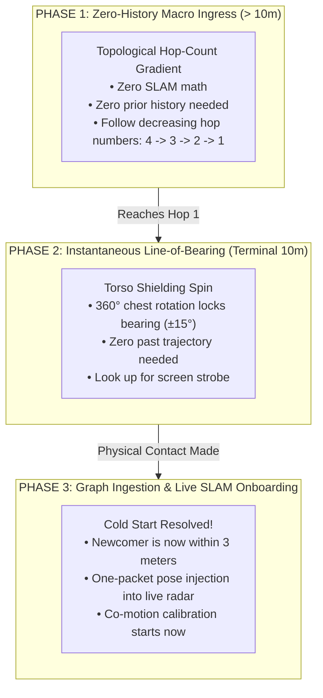

# 12. The Newcomer Problem: Why Pure SLAM Fails and How Our Dual-Tier Architecture Fixes It

> [!IMPORTANT]
> **The Critical User Insight:**
> *"Doesn't this SLAM system fail the moment someone else wants to come and figure out where people are?"*
> 
> **The Blunt Answer: YES.** 
> If you build a navigation app that relies **purely on Cooperative SLAM** (relative poses, trajectory matching, co-walking calibration, and PDR history), **it fails catastrophically the moment an outsider, a lost friend, or a paramedic tries to find the group**.
> 
> Below is the mathematical explanation of why pure SLAM collapses on cold starts, and how our **Dual-Tier Architecture** completely circumvents the failure.

---

## 💥 PART 1: Why Pure SLAM Fails for a Newcomer (The Cold-Start Trap)

Imagine Friends A, B, and C have been walking together for 20 minutes:
* Their phones have calibrated each other's step sizes.
* Their filters know where each person is relative to the other.
* They have a nice relative radar map.

Now, **Friend D (who got lost 40 meters away) or Paramedic E** enters the area and wants to find them.

```text
    [FRIENDS A, B, C]                             [NEWCOMER D / MEDIC]
   (Warm State: 20 mins of PDR                   (Cold Start: Zero history,
    calibrated co-motion)                         zero shared trajectory,
            │                                     40 meters away behind crowd)
            ▼                                                 ▼
   Can they build a relative SLAM link? ────────────► ❌ IMPOSSIBLE!
```

### The 4 Mathematical Reasons Pure SLAM Fails Here:

1. **Infinite Initial Covariance ($\mathbf{\Sigma}_{\text{new}} = \infty$):**
   * SLAM requires an initial state estimate. A newcomer 40 meters away has unknown position $(x, y)$ and unknown heading $\theta$. The covariance is boundless.
2. **The Distance Barrier (No Direct RF Link):**
   * SLAM requires continuous direct sensor measurements (range, bearing, or visual features).
   * At 40 meters in a dense crowd, Bluetooth radio direct line-of-sight is dead (human bodies attenuate 2.4 GHz signal). Phone D **cannot hear Phone A directly**.
   * Phone D can only receive multi-hop relayed packets through 4 stranger phones. You **cannot run continuous kinematic SLAM through stranger relays** whose physical motions are unknown!
3. **Zero Co-Motion History (The Trajectory Fallacy):**
   * You cannot run trajectory alignment algorithms (Kabsch/Umeyama) because Phone D was not walking next to Phone A. Their past step vectors have zero correlation.
4. **The Catch-22 Paradox:**
   * To calibrate SLAM between two phones, they must be close together ($<5\text{m}$) and turn together.
   * But the whole reason Phone D needs navigation is because **they are NOT close together**!

---

## 🛡️ PART 2: How Find Us Solves It — The Three-Phase Ingress Engine

Because pure SLAM fails for newcomers, **we NEVER use SLAM to find the group**. 

Instead, the newcomer moves through three distinct phases:



---

## 🏃 PART 3: Detailed Step-by-Step Walkthrough of a Newcomer

Let’s trace exactly what happens when Friend D (or an outside Medic) arrives.

### Phase 1: Macro Ingress (40 meters away) — Zero History Needed
* Friend D’s phone does **not** attempt to calculate $(x,y)$ coordinates.
* Friend D’s phone simply scans for the public envelope of their group:
  * From the South: Packets saying `[GroupHash, Hop 4]`
  * From the East: Packets saying `[GroupHash, Hop 3]`
* Phone D displays a massive directional gradient:
  * **"Walk toward East (Hop 3 area)."**
* As Friend D walks East:
  * Packets drop from `Hop 3` to `Hop 2`.
  * Then from `Hop 2` to `Hop 1`.
* **Zero calibration was needed. Zero SLAM was running. The newcomer navigated purely via graph topology!**

---

### Phase 2: Terminal Acquisition (Within 10 meters) — Instantaneous Bearing
* Once Friend D reaches `Hop 1`, Phone D detects direct BLE packets from Friend A.
* But Phone D still doesn't have a SLAM trajectory. Which way is Friend A facing? Is Friend A to the left or right?
* Phone D vibrates: **"Target within 10 meters! Hold phone to chest and turn around."**
* Friend D turns $360^\circ$ on the spot:
  * Friend D’s own body absorbs $18\text{ dB}$ of Bluetooth signal.
  * When Friend D faces Friend A, the signal peaks sharply.
  * The screen points: **"Straight ahead at your 12 o'clock."**
* Friend D looks up and sees Friend A’s screen strobing amber.
* **Physical rendezvous is accomplished without running a single SLAM equation!**

---

### Phase 3: Graph Ingestion (Adding the Newcomer to the Live Radar Map)
Now that Friend D is standing next to Friends A, B, and C, Friend D wants to see everyone on the live radar screen as they walk together to the next stage.

How does the SLAM system onboard Friend D without resetting or crashing?

```text
    [FRIEND A] ◄────── 3.0 meters (Measured via BLE RSSI) ──────► [NEW FRIEND D]
    (Already in                                                   (New Node to Insert)
     Group SLAM)
```

#### The One-Packet Pose Injection Algorithm:
1. **Direct Range & Bearing Initialization:**
   * Friend A’s phone measures direct distance to Friend D: $d_{AD} \approx 3.0\text{ meters}$.
   * Friend A knows Friend D’s relative bearing from the torso scan: $\phi_{AD} \approx 45^\circ$.
2. **Instantaneous State Vector Injection:**
   * In Friend A’s coordinate frame, Friend D’s initial coordinates are set instantly:
     $$\mathbf{p}_D = \begin{bmatrix} d_{AD} \cos(\phi_{AD}) \\ d_{AD} \sin(\phi_{AD}) \end{bmatrix} = \begin{bmatrix} 2.12\text{m} \\ 2.12\text{m} \end{bmatrix}$$
   * Initial covariance is initialized with bounded physical confidence:
     $$\mathbf{\Sigma}_D = \operatorname{diag}\Big( \sigma_d^2, \, \sigma_d^2, \, \sigma_\theta^2, \, \dots \Big)$$
3. **Broadcast to Group:**
   * Friend A broadcasts a single 16-byte `GRAPH_INGEST` packet to Friends B and C:
     `[NODE_D_ADDED, p_D=(+2.1m, +2.1m), Group_Epoch]`
4. **Friends B and C Update Their Maps via Matrix Composition:**
   * Friend B computes D’s position in B’s personal frame using simple $SE(2)$ matrix multiplication:
     $$\mathbf{T}_{BD} = \mathbf{T}_{BA} \cdot \mathbf{T}_{AD}$$
   * Friend D instantly pops up on Friend B’s and Friend C’s radar screens!
5. **Continuous Co-Motion Begins:**
   * Now that they are together, the co-motion calibration engine (Note 11) takes over for Friend D, auto-calibrating their stride length over the next 15 steps.

---

## 🚑 PART 4: What About an Outsider Medic (Who Has Zero Keys)?

What if a professional paramedic enters the crowd to treat a collapsed fan? The medic does not belong to the private friend group and has no cryptographic keys.

Does the system fail for the medic? **NO.**

```text
┌────────────────────────────────────────────────────────────────────────────────────────┐
│                        THE OUTSIDER MEDIC EMERGENCY FLOW                               │
├────────────────────────────────────────────────────────────────────────────────────────┤
│ 1. SOS Trigger: Victim phone broadcasts public [SOS, Hop 0, Baro Delta]               │
│ 2. Mesh Propagation: All bystander phones relay the public hop gradient                │
│ 3. Medic Ingress: Medic opens generic responder app (no login, no pairing, no keys)   │
│ 4. Navigation: Medic follows monotonic descent: Hop 6 -> Hop 5 -> ... -> Hop 0         │
│ 5. Arrival: Medic reaches victim in under 3 minutes with zero prior setup              │
└────────────────────────────────────────────────────────────────────────────────────────┘
```

* The medic **never touches the SLAM layer**.
* The medic uses the **Tier 1 Public Broadcast Plane**.
* The medic’s phone doesn't need to know who the person is, what their group key is, or where they walked 10 minutes ago.
* The medic only needs one answer: *"Which way are the hop numbers getting smaller?"*

---

## 📊 Summary Comparison: Pure SLAM vs. Find Us Dual-Tier

| Scenario | Pure Cooperative SLAM (Traditional) | Find Us Dual-Tier Architecture |
| :--- | :--- | :--- |
| **Newcomer 50m Away in Crowd** | ❌ **FAILS:** Cannot connect, infinite covariance, no direct RF. | ✅ **SUCCEEDS:** Follows discrete hop-count gradient ($N \to 0$). |
| **Medic with Zero Group Keys** | ❌ **FAILS:** Cannot join the private SLAM graph. | ✅ **SUCCEEDS:** Navigates via public unencrypted 32-bit emergency hop field. |
| **Terminal Direction (Last 10m)** | ❌ **FAILS:** Range-only rank deficiency; cannot tell left from right. | ✅ **SUCCEEDS:** Biological torso shielding provides instant $\pm 15^\circ$ bearing. |
| **Adding Friend to Live Radar** | ❌ **FAILS:** Requires resetting coordinate frame or complex bundle adjustment. | ✅ **SUCCEEDS:** Instantaneous $SE(2)$ pose injection once physical rendezvous occurs. |
| **Battery Drain on Searcher** | ❌ **HEAVY:** Continuous matrix inversions searching for convergence. | ✅ **NEGLIGIBLE:** Simple integer comparisons ($O(1)$) until final rendezvous. |
