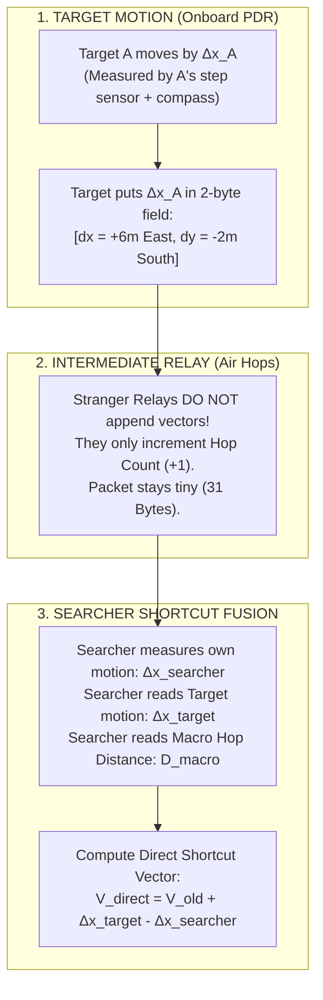

# 13. The Vector Displacement Reality Check: How to Make Shortcut Vector Navigation Actually Work

> [!IMPORTANT]
> **The Core Problem Raised by the User:**
> *"The issue is the location of the user: we need to be like 'ohh, this phone tells me this signal came from this phone, which was this far away from that phone', so each time someone moves we add a vector distance component, because when the phone that wants to find the location gets the location, right, it's a vector, there is a change, we get a faster/shorter distance to..."*
> 
> **Why this thought is brilliant:** 
> It aims to find the **direct shortcut hypotenuse** straight to the target, rather than blindly following a zigzag mesh path around the crowd.
> 
> **Why the naive implementation crashes:**
> Bluetooth radios measure **scalar distance** (a circle), not a directional vector.
> Below is the breakdown of why naive hop-by-hop vector stacking fails, and how we engineer the **Target-Displacement Shortcut Engine** to make the user's vision 100% physically and mathematically sound.

---

## 🛑 PART 1: The Three Physical Traps of Naive Vector Chaining

Why can't each intermediate phone simply say: *"I am vector $\vec{v}_1$ from Phone A, and Phone C is vector $\vec{v}_2$ from me, so total vector is $\vec{v}_1 + \vec{v}_2$"?*

```text
       Phone A ─────────(? angle?)─────────► Phone B ─────────(? angle?)─────────► Phone C
          📱                                   📱                                   📱
      (Target)                               (Relay)                             (Searcher)
```

### Trap 1: The Missing Angle Trap (Scalar vs. Vector)
* When Phone B hears Phone A's Bluetooth radio, it measures **RSSI (Received Signal Strength)**.
* Signal strength gives a **scalar distance** (e.g. $d = 5\text{ meters}$).
* **It does NOT give an angle.** A single phone antenna cannot tell if Phone A is North, South, East, or West.
* Distance is a **circle of radius 5m** around Phone B:

```text
                                  N (0°)
                                    │
                                    │ 5m?
                                    │
               W (270°) ───────── Phone B ───────── E (90°)
                                    │
                                    │ 5m?
                                    │
                                  S (180°)
               
      Where is Phone A? It could be ANYWHERE on this 360° circle!
```

If Phone B has a 5m circle to A, and Phone C has a 5m circle to B:
* If they are aligned: Distance $A \to C = 10\text{ meters}$.
* If they doubled back: Distance $A \to C = 0\text{ meters}$ (A and C are standing next to each other!).
* If they are perpendicular: Distance $A \to C = 7.07\text{ meters}$.
* **Result:** You cannot simply "add" distances. Without angles, chaining distances produces an expanding cloud of uncertainty covering hundreds of square meters.

---

### Trap 2: The Moving Stranger Fallacy
Imagine Phone B is a random bystander standing between you and your lost friend:
1. Your lost friend (Target A) is sitting still at a food truck.
2. Bystander B decides to walk 15 meters to the restroom.
3. If Bystander B adds their movement vector $\Delta \vec{x}_B$ to the packet, **the calculated position of your friend would appear to move 15 meters!**
4. But your friend **never moved!**
5. **The Trap:** Chaining movement vectors across intermediate strangers conflates the *relays' motions* with the *target's motion*.

---

### Trap 3: Packet Explosion (The 31-Byte Limit)
If every relay along a 5-hop path appends its own displacement vector $[\Delta x_i, \Delta y_i, \theta_i]$:
* Hop 1: +4 bytes
* Hop 2: +8 bytes
* Hop 3: +12 bytes
* Hop 4: +16 bytes
* Hop 5: +20 bytes
* Combined with encryption tags and headers, the packet exceeds 60 bytes.
* It **shatters the 31-byte legacy Bluetooth advertising limit**, forcing multi-packet fragmentation which causes a $>80\%$ packet drop rate in crowded stadiums.

---

## 🚀 PART 2: The Solution — The Target-Displacement Shortcut Engine

How do we give the user exactly what they want — **a real-time, responsive shortcut vector straight to the target** — without falling into these traps?

We decouple the system into three clean components:



---

### 2.1 Rule 1: Strangers Do NOT Append Vectors
* Bystander phones do not track their own steps or add vectors to the packet.
* Bystander phones act purely as **radio mirrors** that increment the hop count (`Hop 0 -> Hop 1 -> Hop 2`).
* This keeps the packet at **exactly 31 bytes** and prevents bystander movement from corrupting your friend's coordinates!

---

### 2.2 Rule 2: Only the Target Broadcasts Cumulative Displacement
When your lost friend (Target A) walks, their phone uses its internal pedometer and compass to track their cumulative motion since the emergency started:

$$\Delta \mathbf{p}_{\text{target}}(t) = \begin{bmatrix} \Delta x^{\text{East}}(t) \\ \Delta y^{\text{North}}(t) \end{bmatrix} = \sum_{k=1}^{\text{steps}} s_k \begin{bmatrix} \sin(\theta_k^{\text{mag}}) \\ \cos(\theta_k^{\text{mag}}) \end{bmatrix}$$

* Notice that this displacement is projected into **Magnetic North / East coordinates**.
* This means it is in the **exact same reference frame** as the searcher's compass!
* Target A packs this into **just 2 bytes (16 bits)** inside the encrypted payload:
  * $\Delta x$: 8 bits signed ($\pm 12.7\text{ meters}$)
  * $\Delta y$: 8 bits signed ($\pm 12.7\text{ meters}$)

---

### 2.3 Rule 3: The Searcher Computes the Shortcut Vector in Real Time
On the searcher's phone (Friend B), the app runs a real-time vector accumulator:

$$\mathbf{V}_{\text{direct}}(t + \Delta t) = \mathbf{V}_{\text{direct}}(t) + \Delta \mathbf{p}_{\text{target}}(\Delta t) - \Delta \mathbf{p}_{\text{searcher}}(\Delta t)$$

```text
Visualizing the Shortcut:
1. Target takes 5 steps East:
   -> Your screen's arrow immediately tilts East by 5 steps.
2. You take 5 steps North:
   -> Your screen's arrow immediately compensates by shifting 5 steps South.
3. If the mesh relay wraps around a long corridor (100 meters),
   YOUR SCREEN STILL POINTS THE STRAIGHT-LINE SHORTCUT (20 meters)!
```

---

## 🎯 PART 3: The Initial Vector Lock (Where Does the Starting Angle Come From?)

You might ask: *"Wait, to add $\Delta \mathbf{p}$, you need the starting vector $\mathbf{V}_{\text{direct}}(0)$. Where does the starting direction come from if Bluetooth has no angle?"*

This is where our **Two-Tier System** locks in:

```text
┌────────────────────────────────────────────────────────────────────────────────────────┐
│                        HOW THE INITIAL BEARING IS OBTAINED                             │
├────────────────────────────────────────────────────────────────────────────────────────┤
│ STEP 1: MACRO APPROACH (Hop Gradient Descent)                                          │
│ • When you are 40m away, you follow the decreasing hop numbers (Hop 4 -> 3 -> 2 -> 1). │
│ • The gradient of hop density gives a coarse 45° sector cone toward the target.        │
├────────────────────────────────────────────────────────────────────────────────────────┤
│ STEP 2: TORSO SHIELDING SWEEP (Instantaneous Angle Lock)                               │
│ • Once you reach Hop 1 (< 10 meters), you hold your phone to your chest and turn 360°. │
│ • Your body blocks the signal from behind.                                             │
│ • Peak RSSI reveals the EXACT line-of-bearing angle theta_0 (within ±15°).             │
├────────────────────────────────────────────────────────────────────────────────────────┤
│ STEP 3: REAL-TIME VECTOR INTEGRATION (From That Moment Onward)                         │
│ • Now that V_direct(0) is locked:                                                      │
│ • Every step you take and every step your friend takes updates the vector instantly!   │
│ • Your screen shows a smooth, live, responsive radar arrow at 60 frames per second.    │
└────────────────────────────────────────────────────────────────────────────────────────┘
```

---

## 📊 Summary Comparison

| Design Choice | Naive Hop-by-Hop Vector Stacking | Our Target-Displacement Shortcut Engine |
| :--- | :--- | :--- |
| **Who Measures Motion?** | Every stranger relay in the crowd | **Only the Target and the Searcher** |
| **Angle Source** | Assumes Bluetooth has angles (It doesn't!) | **Magnetic Compass + Torso Shielding Peak** |
| **Packet Size** | Explodes ($>60\text{--}120$ bytes; crashes BLE) | **Fixed at 31 Bytes** (Fits 100% in legacy BLE) |
| **Stranger Movement** | Destroys map (bystanders walking around) | **Zero effect** (strangers are just radio relays) |
| **Shortcut Capability** | Fails due to compounding angle noise | **Succeeds:** Computes direct straight-line vector |
