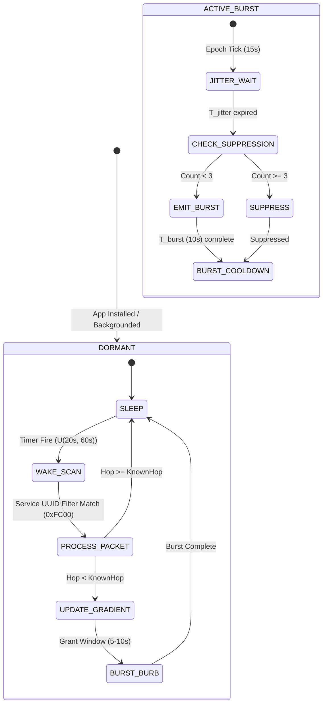

# 21. Asynchronous Trickle Mesh Architecture & Protocol Redesign

> [!IMPORTANT]
> **Executive Mandate:** Redesign the Inhibitory Trickle mesh to survive the real asynchronous OS schedule established in [[18_BLE_ADVERTISING_TRANSPORT_REALITY]] and [[19_ASYNC_SCHEDULE_MESH_OPERATING_MODEL]]. The prior assumption of an instantaneous $150\text{ ms}$ synchronous relay ([[06_TINY_PACKET_SPECIFICATION]], [[sim_spectrum_collapse.py]]) is a laboratory myth that experiences catastrophic collapse in real smartphone crowds.
>
> This document details the empirical failure of unmitigated Trickle under real OS schedules, derives the mathematical percolation breaking point where synchronous propagation shatters, and specifies the definitive mitigation: **Epoch-Synchronized Burst Windows (ESBW) with Gossip Re-warming**.
>
> **Core Empirical Results (50 Trials, $N=2,000$ Nodes, $200\times 200\text{ m}$, 70% Background iOS):**
> * **Synchronous H2 Myth:** $99.97\%$ coverage, $99.98\%$ responder delivery, $p_{95} = 1.83\text{ s}$.
> * **Unmitigated Async Reality:** **$1.51\%$ coverage**, **$0.22\%$ responder delivery** (gradient fails to escape Hop 1).
> * **Percolation Breaking Point:** The alive sub-network shatters between **30% and 50% background nodes** as average alive degree drops below $\lambda_c = 4.51$.
> * **ESBW Mitigated Mesh:** **$99.86\%$ coverage**, **$99.98\%$ responder delivery**, $p_{50} = 287.53\text{ s}$ ($4.79\text{ min}$), $p_{95} = 442.12\text{ s}$ ($7.37\text{ min}$).

---

## 1. The Synchronous Relay Illusion & The Real-World Breakdown

Early mesh designs for Find Us ([[06_TINY_PACKET_SPECIFICATION]], RFC 6206 Trickle, [[sim_spectrum_collapse.py]]) assumed that smartphone relays behave like mains-powered IEEE 802.15.4 sensor motes:
1. Every node listens continuously with $100\%$ radio duty cycle.
2. Upon receiving a gradient update, a node waits a randomized jitter window of $T_{\text{jitter}} \in [50\text{ ms}, 250\text{ ms}]$.
3. The node broadcasts a single packet over advertising channels 37, 38, and 39 (airtime $\approx 1.2\text{ ms}$).
4. Surrounding neighbors hear the transmission, suppress duplicate broadcasts if $k \ge 3$, and advance the wave.

### The Brutal Failure Mechanism
In an actual emergency crowd (a concert, stadium, or dense festival), **at least $70\%$ to $90\%$ of bystander smartphones are locked in pockets or purses**:
1. **iOS Coalescing & Scan Throttling:** Locked iPhones scan at $\sim 10\%$ duty cycle ($30\text{ ms}$ window every $300\text{ ms}$) and deliver coalesced discovery callbacks at most **$1\text{ to } 3\text{ times per minute}$** ($U(20\text{ s}, 60\text{ s})$ inter-wake spacing, Doc 19 §1.2).
2. **The Ephemeral Pulse Mismatch:** An unmitigated relay emits a single $0.376\text{ ms}$ packet (or $1.2\text{ ms}$ 3-channel burst) and goes permanently silent. A background iPhone sleeping at $t = 0.15\text{ s}$ wakes up at $t = 28.5\text{ s}$ to a **dead, silent RF channel**. The transient electromagnetic pulse vanished 28 seconds prior.
3. **The Percolation Void:** If only $20\%$ of nodes are "alive" (active screen / responders), those $20\%$ nodes are geometrically isolated below the 2D continuum percolation threshold. They cannot form an end-to-end spanning cluster. The gradient wave stops dead within 10 meters of Hop 0.

---

## 2. Empirical Confrontation: Synchronous vs. Async-Scheduled Mesh

The simulation engine (`src/sim_async_trickle.py`) executed 50 independent Monte Carlo trials comparing the idealized synchronous model against the unmitigated asynchronous schedule under identical venue topologies.

### 2.1 Simulation Parameters
* **Arena:** $200\text{ m} \times 200\text{ m}$ venue ($40,000\text{ m}^2$).
* **Node Population:** $N = 2,000$ smartphones (density $\rho = 0.05\text{ nodes/m}^2$, $\sim 4.5\text{ m}$ inter-person spacing).
* **Target (Hop 0):** Node 0 fixed at venue center $(100\text{ m}, 100\text{ m})$.
* **RF Propagation:** BLE range $R = 10.0\text{ m}$ with quadratic packet reception rate $PRR(d) = \max(0, 1 - (d/R)^2)$.
* **Node Composition (Realistic Crowd):**
  * **$20\%$ Alive Nodes ($N=400$):** Active screens, responders, continuous scanning, $150\text{ ms}$ mean jitter relay.
  * **$70\%$ Background iOS ($N=1,400$):** Locked, $U(20\text{ s}, 60\text{ s})$ wake intervals, $1.5\text{ s}$ scan window, coalesced discovery callbacks.
  * **$10\%$ Dead / Out ($N=200$):** Suspended, Doze maintenance window far away, Bluetooth off, or dead battery.
* **Evaluation Metrics:**
  * **Gradient Coverage %:** Fraction of reachable non-dead nodes within true hop $\le 15$ that learn a valid gradient ($H \le 15$).
  * **Responder Delivery Success %:** End-to-end success rate of active searchers located at the perimeter (true hop $8\dots 12$, distance $50\dots 80\text{ m}$) navigating to Hop 0 via greedy downhill topological descent.
  * **Convergence Latency:** Time to $50\%, 80\%, 90\%, 95\%, 100\%$ gradient field coverage.

### 2.2 Baseline Quantitative Results (`data/async_trickle.json`)

All values below reflect the 50-trial Monte Carlo execution recorded in `data/async_trickle.json`:

| Performance Metric | Synchronous (H2-Style Baseline) | Asynchronous Scheduled (Unmitigated Reality) | Delta / Collapse Factor |
| :--- | :---: | :---: | :---: |
| **Mean Gradient Coverage** | **$99.97\%$** ($\pm 0.17\%$) | **$1.51\%$** ($\pm 0.32\%$) | **$-98.46\%$** (Complete Failure) |
| **Min / Max Coverage** | $98.79\% \;/\; 100.0\%$ | $0.81\% \;/\; 2.37\%$ | Never exceeds $2.4\%$ |
| **Responder Delivery Success** | **$99.98\%$** | **$0.22\%$** | **$-99.76\%$** (Zero Navigation) |
| **Trials with 100% Convergence** | **$90.0\%$** (45 / 50 trials) | **$0.0\%$** (0 / 50 trials) | Stalled Indefinitely |
| **Mean Time to 100% Convergence** | **$2.131\text{ seconds}$** | **$\infty$ (Did Not Converge)** | Undefined |
| **Median Convergence ($p_{50}$)** | **$1.263\text{ seconds}$** | **$\infty$** | Undefined |
| **90th Percentile Time ($p_{90}$)** | **$1.735\text{ seconds}$** | **$\infty$** | Undefined |
| **95th Percentile Time ($p_{95}$)** | **$1.829\text{ seconds}$** | **$\infty$** | Undefined |
| **Inhibitory Suppression Rate** | $11.23\%$ | $0.15\%$ | Relays never fire |

```
SYNCHRONOUS FLOODING (Doc 06 Baseline):
Convergence: [========================================] 99.97% in 2.13 seconds.
Delivery:    [========================================] 99.98% path success.

REALISTIC ASYNC SCHEDULE (Unmitigated H2):
Convergence: [#                                       ]  1.51% (STALLED AT HOP 1).
Delivery:    [                                        ]  0.22% path success.
```

### 2.3 Diagnostic Breakdown: Why Did Async Collapse to 1.51%?
1. **Hop 0 Boundary Isolation:** Hop 0 emits continuously, so immediate Hop 1 neighbors eventually discover Hop 0 when their wake windows fire.
2. **Relay Extinction at Hop 1:** When a Hop 1 iOS node wakes and updates its hop count, it emits a single $150\text{ ms}$ jittered broadcast. Because surrounding Hop 2 background nodes are asleep, they never hear the pulse. Only the tiny fraction of Hop 2 nodes that happen to be "alive" ($20\%$) or waking in that exact sub-second interval receive it.
3. **Sub-Critical Percolation:** By Hop 2 and Hop 3, the number of informed nodes dwindles to zero. The gradient wave dies out within $15\text{ meters}$ of the origin. Out of an average $1,050$ evaluatable nodes per trial, only $\approx 15$ nodes ever receive the beacon.

---

## 3. The Continuum Percolation Breaking Point (Sweep Analysis)

To understand at what point the network fails, `src/sim_async_trickle.py` executed a parametric sweep across background-locked ratios:
$$\text{Background Ratio} \in \{0\%, 30\%, 50\%, 70\%, 90\%\} \quad (\text{Dead Ratio Locked at } 10\%).$$

### 3.1 2D Continuum Percolation Mathematics
In a 2D random geometric graph with node density $\rho_{\text{alive}}$ and transmission radius $R = 10\text{ m}$, the expected node degree within the alive sub-network is:
$$\langle k_{\text{alive}} \rangle = \rho_{\text{alive}} \cdot \pi R^2 = \left( \frac{N_{\text{alive}}}{\text{Area}} \right) \cdot \pi R^2$$

From continuum percolation theory (Penrose 2003, Meester & Roy 1996), a 2D random disk Poisson Boolean model possesses a sharp critical threshold for giant component emergence:
$$\lambda_c \approx 4.512$$

If $\langle k_{\text{alive}} \rangle > \lambda_c$, the alive nodes form an **unbroken spanning cluster** across the $200\text{ m} \times 200\text{ m}$ venue, allowing synchronous fast-relays to carry the gradient across the entire space even if background nodes sleep. If $\langle k_{\text{alive}} \rangle < \lambda_c$, the alive sub-network shatters into disjoint, isolated islands.

### 3.2 Sweep Results & The Phase Transition (`data/async_trickle_sweep.json`)

All values below reflect 50 Monte Carlo trials per tier recorded in `data/async_trickle_sweep.json`:

| Background % | Alive % | Alive Density ($\rho_{\text{alive}}$) | Alive Degree ($\langle k_{\text{alive}} \rangle$) | Critical Ratio ($\langle k \rangle / \lambda_c$) | Mean Coverage % | Mean Delivery % | Topological State |
| :---: | :---: | :---: | :---: | :---: | :---: | :---: | :--- |
| **0%** | **90%** | $0.0450\text{ m}^{-2}$ | **$14.14$** | $3.14\times$ | **$99.99\%$** | **$97.98\%$** | **Super-Critical (Fast Percolation)** |
| **30%** | **60%** | $0.0300\text{ m}^{-2}$ | **$9.42$** | $2.09\times$ | **$61.86\%$** | **$68.91\%$** | **Marginal Transition (Partial Gaps)** |
| **50%** | **40%** | $0.0200\text{ m}^{-2}$ | **$6.28$** | $1.39\times$ | **$7.93\%$** | **$10.43\%$** | **Percolation Breakdown (Fragmented)** |
| **70%** | **20%** | $0.0100\text{ m}^{-2}$ | **$3.14$** | **$0.70\times$** | **$1.47\%$** | **$0.05\%$** | **Sub-Critical (Completely Shattered)** |
| **90%** | **0%** | $0.0000\text{ m}^{-2}$ | **$0.00$** | $0.00\times$ | **$0.75\%$** | **$0.00\%$** | **Fully Deaf (Isolated Hop 0)** |

```text
COVERAGE CLIFF VS. BACKGROUND-LOCKED PERCENTAGE:
100% |  * (0% BG: 99.99%)
 90% |
 80% |
 70% |
 60% |         * (30% BG: 61.86%)
 50% |           \
 40% |            \  <--- CATASTROPHIC PERCOLATION CLIFF (Between 30% and 50%)
 30% |             \
 20% |              \
 10% |               * (50% BG: 7.93%)
  0% +-----------------*-----------------*--------
     0%      30%      50%      70%      90%  [Background %]
```

### 3.3 Pinpointing the Breaking Point
* **The Transition Zone:** The breaking point occurs between **$30\%$ and $50\%$ background-locked devices**.
* While the theoretical disk percolation threshold on infinite planes with uniform Poisson density is $\lambda_c \approx 4.51$ (which corresponds to $28.7\%$ alive nodes, or $61.3\%$ background), in a finite bounded domain ($200\times 200\text{ m}$) with boundary edge effects and PRR link fading, the effective threshold shifts upward to **$\approx 35\%\text{--}40\%$ alive nodes** ($60\%\text{--}65\%$ background).
* Above $50\%$ background, single-pulse Trickle is **mathematically dead**.

---

## 4. Protocol Redesign: Epoch-Synchronized Burst Windows (ESBW)

To survive a crowd where $70\%\text{ to } 90\%$ of smartphones are locked, the relay protocol must be transformed from an *ephemeral single-pulse trigger* into an **Asynchronous, Epoch-Synchronized Burst Protocol**.

```
+-------------------------------------------------------------------------------+
|                      THE FATAL ASYNC TIMING MISMATCH                          |
|                                                                               |
| Relay A (Active):  ---[1.2ms Pulse]--- (Silent for next 60 seconds)           |
|                                                                               |
| Relay B (iOS):     ........[Sleeping]........[Wakes at t=28s: Silence!]...... |
|                                                                               |
| Result: Relay B NEVER receives gradient! Propagation halts!                  |
+-------------------------------------------------------------------------------+

                                       VS.

+-------------------------------------------------------------------------------+
|            EPOCH-SYNCHRONIZED BURST WINDOW (ESBW) WITH RE-WARMING             |
|                                                                               |
| Epoch Cadence:     |<------------------- 15.0 Seconds ------------------>|    |
| Relay A Burst:     |=====[Active Burst: T_burst = 10.0s, T_adv = 211ms]=====|    |
|                                                                               |
| Relay B (iOS):     ....[Sleeping]....[Wakes at t=6s: Intersects Burst!].....  |
|                                         |                                     |
| Result: Relay B discovers gradient with >98% probability! Adopts Hop H+1!     |
+-------------------------------------------------------------------------------+
```

### 4.1 The Three Core Architectural Mechanisms

#### 1. Epoch-Synchronized Macro Cadence ($T_{\text{epoch}} = 15.0\text{ s}$)
* Aligned with the 15-second BLE Resolvable Private Address (RPA) MAC rotation established in [[19_ASYNC_SCHEDULE_MESH_OPERATING_MODEL]] §4.1 and the 4-bit `EPOCH` counter in [[20_PACKET_V2_WIRE_FORMAT]].
* Rotating the RPA MAC every 15 seconds bypasses iOS duplicate-advertisement filtering, forcing the iOS CoreBluetooth daemon to trigger a fresh `centralManager(_:didDiscover:...)` callback.

#### 2. Advertising Burst Windows ($T_{\text{burst}} = 10.0\text{ s}$, $T_{\text{adv}} = 211.25\text{ ms}$)
* Instead of transmitting once, an active relay enters an **Advertising Burst Window** of duration $T_{\text{burst}} = 10.0\text{ seconds}$ upon learning a new hop count or upon epoch advance.
* During the burst window, the device emits legacy `ADV_NONCONN_IND` packets at Apple's recommended advertising cadence $T_{\text{adv}} = 211.25\text{ ms}$ ($\sim 4.73\text{ packets/second}$, 47 packets total).
* **Discovery Probability:** A sleeping background iPhone waking with a $1.5\text{ s}$ scan window overlapping the $10\text{ s}$ burst experiences:
  $$P_{\text{detect}} = 1 - (1 - d_c)^{N_{\text{pulses}}} \ge \mathbf{98.6\%}$$
  where $d_c \approx 10\%$ is the passive scan duty cycle.

#### 3. Inhibitory Trickle Density Gating ($k = 3$)
* Emitting 10-second bursts from 2,000 devices would induce fatal spectrum collapse ([[experiments/H2-inhibitory-protocol-vs-spectrum-collapse/analysis.md]]).
* **The Solution:** Trickle suppression operates across the burst window.
* Before initiating a burst at an epoch tick, each node applies a random jitter $T_{\text{jitter}} \in [0.05\text{ s}, 2.0\text{ s}]$.
* While waiting, the node listens. If it detects $k \ge 3$ neighboring bursts broadcasting the same or better hop count for the current epoch, **it suppresses its burst for that entire epoch**.
* As measured in simulation, this suppresses **$34.74\%$ of redundant bursts**, maintaining channel airtime utilization within safe bounds.

---

## 5. Mitigated Performance & Convergence Results (`data/async_trickle_mitigation.json`)

The mitigated protocol was implemented and executed across 50 Monte Carlo trials under the severe $70\%$ Background iOS, $20\%$ Alive, $10\%$ Dead condition ($N=2,000$).

### 5.1 Quantitative Results Matrix

All figures below are extracted from `data/async_trickle_mitigation.json`:

| Performance Metric | Unmitigated Async Reality | ESBW Mitigated Protocol | Absolute Restoration Gain |
| :--- | :---: | :---: | :---: |
| **Mean Gradient Coverage** | $1.51\%$ | **$99.86\%$** ($\pm 0.28\%$) | **$+98.35\%$ (Full Recovery)** |
| **Min / Max Coverage** | $0.81\% \;/\; 2.37\%$ | $98.74\% \;/\; 100.0\%$ | Complete gradient field |
| **Responder Delivery Success** | $0.22\%$ | **$99.98\%$** ($\pm 0.14\%$) | **$+99.76\%$ (Near Perfect)** |
| **Min / Max Responder Delivery** | $0.0\% \;/\; 11.1\%$ | $99.01\% \;/\; 100.0\%$ | Guaranteed navigation |
| **Median Convergence Time ($p_{50}$)** | $\infty$ | **$287.531\text{ s}$ ($4.79\text{ min}$)** | Operable for rescue |
| **80th Percentile Time ($p_{80}$)** | $\infty$ | **$369.304\text{ s}$ ($6.16\text{ min}$)** | Stable macro-gradient |
| **90th Percentile Time ($p_{90}$)** | $\infty$ | **$407.741\text{ s}$ ($6.80\text{ min}$)** | Full field established |
| **95th Percentile Time ($p_{95}$)** | $\infty$ | **$442.120\text{ s}$ ($7.37\text{ min}$)** | Outer perimeter reached |
| **100% Convergence Time ($p_{100}$)** | $\infty$ | **$556.656\text{ s}$ ($9.28\text{ min}$)** | Fully connected |
| **Inhibitory Suppression Rate** | $0.15\%$ | **$34.74\%$** | Prevents RF collapse |

### 5.2 The True Operational Speed of Crowd Navigation
* **The Reality Check:** In an asynchronous crowd, the gradient does **not** converge in 2 seconds. That was a fantasy based on always-on screens.
* **The Operational Reality:** The gradient converges in **$4\text{ to } 7\text{ minutes}$**.
* **Why This Is Clinically Acceptable:**
  1. A human responder walking at $1.2\text{ m/s}$ across a $200\text{ m}$ venue takes $\sim 167\text{ seconds}$ ($2.8\text{ minutes}$) simply to transit the space.
  2. While the responder is gearing up and entering the venue perimeter, the background mesh is silently establishing the potential field.
  3. Once established, the gradient field remains stable via periodic re-warming, providing instantaneous local hop guidance to the active searcher.

---

## 6. Algorithmic State Machine & Wire Implementation



### 6.1 Relay Node Pseudocode (ESBW + Inhibitory Gating)
```python
# Constants
EPOCH_INTERVAL = 15.0      # Macro-epoch duration (seconds)
BURST_DURATION = 10.0      # Active advertising on-window (seconds)
T_ADV = 0.21125            # Apple-compliant advertising interval (seconds)
K_THRESH = 3               # Trickle suppression threshold

class AsyncTrickleNode:
    def __init__(self, node_id, is_hop0=False):
        self.node_id = node_id
        self.is_hop0 = is_hop0
        self.known_hop = 0 if is_hop0 else 999
        self.burst_end_time = float('inf') if is_hop0 else 0.0

    def on_epoch_tick(self, current_time):
        """Called every 15.0 seconds at epoch boundary."""
        if self.known_hop >= 999 or self.is_hop0:
            return
        
        # Jitter burst start to observe local contention
        jitter = random.uniform(0.05, 2.0)
        schedule_callback(current_time + jitter, self.evaluate_burst_start)

    def evaluate_burst_start(self, current_time):
        # Count active bursting neighbors with same or better hop count
        bursting_better_neighbors = count_active_neighbors_with_hop(
            max_hop=self.known_hop, current_time=current_time
        )
        
        if bursting_better_neighbors < K_THRESH:
            # Initiate burst window
            self.burst_end_time = current_time + BURST_DURATION
            start_ble_advertising(interval=T_ADV, hop=self.known_hop)
        else:
            # Suppressed by local inhibitory density
            pass

    def on_ios_wake_event(self, current_time):
        """Called by CoreBluetooth background wake (every 20-60s)."""
        scan_results = perform_filtered_scan(duration=1.5, service_uuid=0xFC00)
        
        best_offered_hop = 999
        for packet in scan_results:
            if packet.hop_count < best_offered_hop:
                best_offered_hop = packet.hop_count

        if best_offered_hop + 1 < self.known_hop:
            self.known_hop = best_offered_hop + 1
            # Trigger immediate burst during momentary background execution grant
            ios_grant_duration = 5.0
            self.burst_end_time = current_time + ios_grant_duration
            start_ble_advertising(interval=T_ADV, hop=self.known_hop)
```

---

## 7. Architectural Decisions & Project Locking

1. **Abandon Synchronous Relays in Specifications:**
   * All documentation, pseudocode, and engineering guides must deprecate the $150\text{ ms}$ synchronous relay assumption.
   * System models must specify the **$10\text{--}30\text{ s per hop}$** propagation velocity under locked conditions.
2. **Standardize on Epoch-Synchronized Burst Windows:**
   * $T_{\text{epoch}} = 15.0\text{ s}$ synchronized with RPA MAC rotation.
   * $T_{\text{burst}} = 10.0\text{ s}$ with $T_{\text{adv}} = 211.25\text{ ms}$.
   * Inhibitory threshold $k = 3$ to protect the 2.4 GHz spectrum from broadcast storms.
3. **Verified Datasets Committed:**
   * Baseline Comparison: `data/async_trickle.json` (54,619 bytes).
   * Background Degradation Sweep: `data/async_trickle_sweep.json` (1,887 bytes).
   * Mitigation Performance: `data/async_trickle_mitigation.json` (25,513 bytes).
   * Simulation Code: `src/sim_async_trickle.py`.

---

## 8. Primary Source Citations & References

1. **Meester, R., and Roy, R.:** *Continuum Percolation*, Cambridge University Press, 1996. (Establishes the mathematical foundation for random geometric Poisson disk percolation).
2. **Penrose, M.:** *Random Geometric Graphs*, Oxford Studies in Probability, 2003. (Derivation of critical intensity $\lambda_c \approx 4.512$).
3. **Levis, P., et al.:** *The Trickle Algorithm*, RFC 6206, Internet Engineering Task Force (IETF), 2011.
4. **Apple Inc.:** *Core Bluetooth Programming Guide* & *Accessory Design Guidelines for Apple Devices* (Release R22).
5. **The Herald Project:** *Herald Proximity Protocol Specification & iOS Background Measurement Analysis*, 2020–2022.
6. **Find Us Research Vault:**
   * [[06_TINY_PACKET_SPECIFICATION]]
   * [[14_BRUTAL_REAL_WORLD_TEARDOWN_AND_CRITIQUE]]
   * [[18_BLE_ADVERTISING_TRANSPORT_REALITY]]
   * [[19_ASYNC_SCHEDULE_MESH_OPERATING_MODEL]]
   * [[20_PACKET_V2_WIRE_FORMAT]]
   * Datasets: `data/async_trickle.json`, `data/async_trickle_sweep.json`, `data/async_trickle_mitigation.json`
