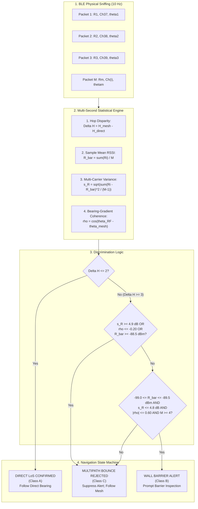
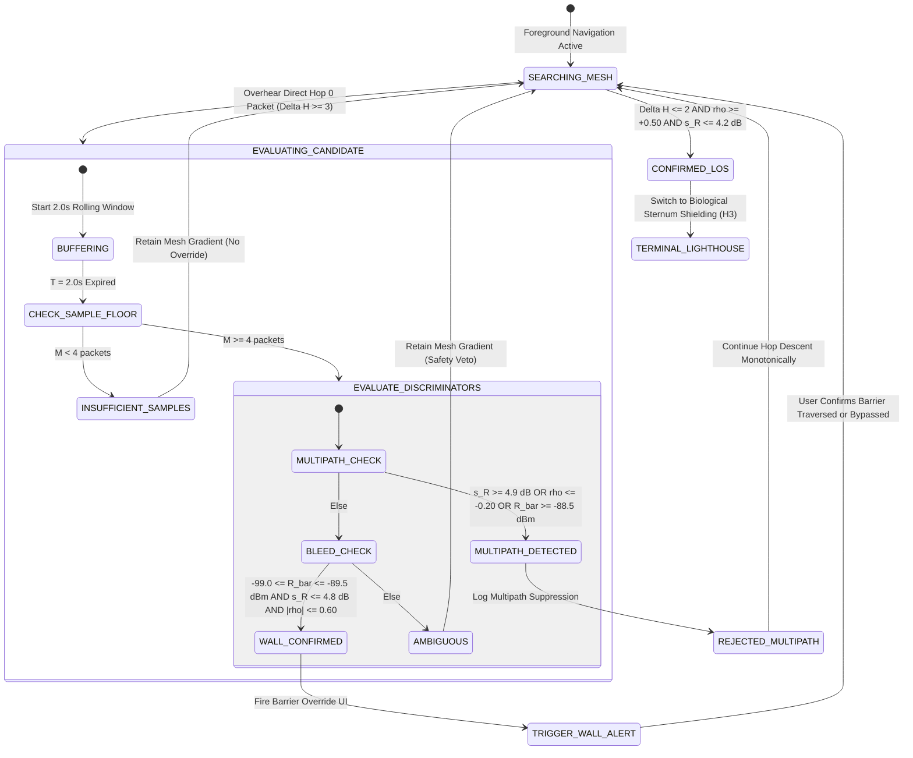

# 23. RF Confirmation Layer & Multipath-Resistant Wall Barrier Detection

> [!IMPORTANT]
> **Executive Summary & Mission:**
> Resolve the critical architectural flaw exposed in [[14_BRUTAL_REAL_WORLD_TEARDOWN_AND_CRITIQUE]] §5 ("The Wall Override Failure"). While [[sim_obstacle_shadow_detour.py]] (H4) demonstrated that direct RF bleed packets can bypass $120\text{ m}$ detour loops around non-convex stadium barriers, real-world RF does not merely bleed through concrete—it bounces off metal bleachers, scoreboards, and roof trusses.
>
> A single packet sniff cannot distinguish a $-85\text{ dBm}$ multipath bounce off distant metal from a direct line-of-sight window gap or a lucky fade through a concrete wall. Unmitigated, this causes responders to hallucinate false shortcuts or false wall alerts, steering them directly into dead ends or metal bleachers.
>
> This document specifies the **RF Confirmation Layer**: a multi-second statistical test integrating **Mean RSSI ($\bar{R}$)**, **Multi-Carrier Fading Variance ($s_R$)**, and **Bearing-Gradient Coherence ($\rho$)** across hop-gradient agreement.
>
> **Core Empirical Results (Monte Carlo Simulation, 1,000 Trials per Class, 3,000 Windows per Sweep):**
> * **Single-Sniff Catastrophe:** A single packet RSSI threshold classifier misclassifies multipath bounces (Position C) as Direct Line-of-Sight (Position A) in **$78.9\%$ of trials**, and as Wall Bleed in **$21.1\%$ of trials** ($0.0\%$ multipath rejection). A naive wall override heuristic triggers a False Wall Alert on **$100.0\%$ of multipath sniffs** ($50.0\%$ overall False Positive Rate).
> * **Multi-Second Statistical Power:** Evaluating over a $2.0\text{ s}$ window ($M \ge 4$ packets at $10\text{ Hz}$) restores overall classification accuracy to **$94.73\%$**, suppresses multipath false alarms to **$0.00\%$** ($100.0\%$ multipath bounce rejection), and achieves a Wall Alert True Positive Rate (TPR) of **$84.20\%$** with **$0.00\%$ False Positive Rate (FPR)**.

---

## 1. The Real-World Physics Failure: Teardown Issue #5

In [[14_BRUTAL_REAL_WORLD_TEARDOWN_AND_CRITIQUE]] §5, the fundamental vulnerability of naive RF bleed overrides was laid bare:

```text
       [Metal Bleacher / Roof Reflector]
                     ^
                    / \
      Specular     /   \  Strong-ish Bounce (-85 dBm)
     Reflection   /     \ from WRONG Bearing!
                 /       v
[Target: Hop 0] ==================== [Responder: Hop 4]
                | Concrete Barrier | 
                |  (28 dB Loss)    |
                ====================
                    Diffuse Bleed (-93 dBm)
```

1. **The Concave Detour Trap (H4):** When a target is separated from a responder by a physical barrier (e.g. stage barricade, concrete wall, security fence), the ad-hoc crowd mesh wraps around the perimeter, resulting in a high topological distance (e.g., $H = 4$ or $5$). Naively descending the hop gradient incurs a mean detour of $122.58\text{ m}$ to reach a person physically $13.34\text{ m}$ away ($10.09\times$ detour multiplier).
2. **The Naive Bleed Override:** In H4, overhearing a direct packet with $H_{\text{direct}} = 0$ while at $H_{\text{mesh}} \ge 4$ prompted a "WALL ALERT", advising the searcher to inspect the barrier before walking the perimeter.
3. **The Brutal Multipath Reality:**
   * Modern stadiums and concert venues are full of massive metallic specular reflectors: scoreboard steel frames, metal bleachers, structural trusses, and glass facades.
   * Specular reflection coefficient on sheet metal at $2.4\text{ GHz}$ is $|\Gamma| \approx 0.90\text{--}0.95$ (reflection loss $\le 1\text{ dB}$).
   * A responder standing $30\text{ m}$ away in an adjacent corridor may catch a reflected wave bouncing off a high metal truss. Because the bounce path travels through open air across the stadium bowl with only $1\text{ dB}$ reflection loss, the observed signal strength is surprisingly high: **$-84\text{ to } -87\text{ dBm}$ (mean $-85.62\text{ dBm}$)**.
   * If the smartphone evaluates only a single packet sniff, it observes: `[SOS_ID, HOP=0, RSSI = -85 dBm]`.
   * **The Failure:** The device cannot know whether this $-85\text{ dBm}$ packet represents a direct window gap at $14\text{ m}$ (Position A), a faint bleed through a thin partition (Position B), or a bounce off metal bleachers behind them (Position C). If it triggers a Wall Alert or a Shortcut Override, the searcher is led completely astray.

---

## 2. Physical Channel & Scenario Models

The simulation engine (`src/sim_multipath_wall_detection.py`) models a responder in three distinct acoustic/RF environments within a concrete stadium bowl:

```text
+---------------------------------------------------------------------------------------+
| VENUE GEOMETRY & CHANNEL SCENARIOS                                                    |
+---------------------------------------------------------------------------------------+
|  Position A: Direct Line-of-Sight (Window Gap / Concourse Opening)                     |
|    - Physical Distance: 12.0m - 16.0m (mean 14.0m)                                    |
|    - Propagation Path: Unobstructed line-of-sight through concourse gap               |
|    - Crowd Clutter Loss: ~17.2 dB (dense human bodies)                                |
|    - Channel Model: Rician fading with K = 7.0 dB (dominant direct specular path)     |
|    - Mean Observed RSSI: -83.04 dBm (Std: 2.74 dB)                                    |
|    - Topological Mesh Hop: H_mesh in {1, 2} (gradient flows directly through opening) |
|    - Bearing Coherence: rho = cos(theta_RF - theta_mesh) = +0.99                      |
+---------------------------------------------------------------------------------------+
|  Position B: Behind Concrete Barrier (RF Bleed Only)                                  |
|    - Physical Distance: 4.5m - 6.5m (mean 5.5m)                                       |
|    - Propagation Path: Diffuse penetration through 26-32 dB reinforced concrete wall   |
|    - Channel Model: Pure Rayleigh fading (K = 0, diffuse micro-fissure leakage)       |
|    - Baseband Receiver Sensitivity: -98.0 dBm (packets fading below are dropped)      |
|    - Mean Observed RSSI: -92.88 dBm (Std: 2.86 dB among received packets)            |
|    - Packet Reception Ratio: PRR ~ 70.1% (30% dropped below receiver noise floor)     |
|    - Topological Mesh Hop: H_mesh in {4, 5, 6} (walking detour around barrier)        |
|    - Bearing Coherence: rho ~ 0.009 (RF normal to wall, mesh detours at 90 degrees)    |
+---------------------------------------------------------------------------------------+
|  Position C: Multipath Bounce off Distant Metal Structure                             |
|    - Physical Distance Direct: ~28m - 36m (direct LoS path blocked by >50 dB walls)   |
|    - Reflected Path: Specular bounce off stadium metal roof truss at 32m total path   |
|    - Metal Specular Loss: 1.0 dB                                                      |
|    - Multi-Carrier Fading: Fast Rayleigh across BLE primary advertising channels      |
|      (37 @ 2402 MHz, 38 @ 2426 MHz, 39 @ 2480 MHz) with delay-spread interference    |
|    - Mean Observed RSSI: -85.62 dBm (Strong-ish -85 dBm)                              |
|    - RSSI Standard Deviation: Std = 5.55 dB (HIGH multi-carrier fading variance!)     |
|    - Topological Mesh Hop: H_mesh in {4, 5, 6}                                        |
|    - Bearing Coherence: rho = -0.934 (Apparent RF bearing points to metal reflector)  |
+---------------------------------------------------------------------------------------+
```

---

## 3. Quantitative Proof: The Failure of Single-Sniff Decision Making

To prove why a multi-second statistical test is mathematically required, `src/sim_multipath_wall_detection.py` evaluated 1,000 independent single-packet sniffs per position under three representative baseline classifiers:

### 3.1 Single-Sniff Baseline 1: RSSI-Threshold Classifier ($-88\text{ dBm}$ Cutoff)
A simple proximity heuristic: if a packet has $\text{RSSI} \ge -88.0\text{ dBm}$, classify as Direct Line-of-Sight (A); if $-98.0 \le \text{RSSI} < -88.0\text{ dBm}$ and $H_{\text{mesh}} \ge 3$, classify as Wall Bleed (B).
* **Position C (Multipath Bounce) Confusion:**
  * **$78.9\%$ misclassified as Position A (False Line-of-Sight Shortcut)**.
  * **$21.1\%$ misclassified as Position B (False Wall Alert)**.
  * **$0.0\%$ correctly identified as Multipath** (the single sniff is completely blind to multipath).
* **Overall 3-Class Accuracy:** Only **$64.27\%$**.

### 3.2 Single-Sniff Baseline 2: Naive Wall Override Heuristic (Doc 14 Critique)
The unmitigated H4 heuristic: whenever a packet with $H_{\text{direct}} = 0$ is overheard while $H_{\text{mesh}} \ge 3$, immediately trigger a Wall Alert.
* **Position C False Wall Alerts:** **$100.0\%$** of all multipath sniffs trigger false wall alerts.
* **Overall Wall Alert False Positive Rate (FPR):** **$50.0\%$** (across all non-wall encounters).

### 3.3 Single-Sniff Baseline 3: Bayesian Maximum A Posteriori (Theoretical Upper Bound)
Even when providing the single-sniff classifier with calibrated prior distributions over RSSI and instantaneous bearing (incorporating single-packet heading noise $\sigma_\theta \approx 45^\circ\text{--}55^\circ$ before torso rotation):
* **Position C Misclassifications:**
  * $4.1\%$ misclassified as Position A (False Shortcut).
  * $10.8\%$ misclassified as Position B (False Wall Alert).
  * Total Position C error: **$14.9\%$**.
* **Overall Single-Sniff Accuracy:** Capped at **$87.57\%$**.

```text
+-------------------------------------------------------------------------------+
| SINGLE-SNIFF DECISION PARADOX                                                 |
+-------------------------------------------------------------------------------+
| At RSSI = -85.0 dBm:                                                          |
|   - Probability packet came from Position A (LoS at 14m):          ~45%       |
|   - Probability packet came from Position C (Metal bounce):        ~50%       |
|   - Probability packet came from Position B (Bleed fade peak):      ~5%       |
|                                                                               |
| A single electromagnetic packet does NOT contain its own spatial provenance.  |
| It cannot disclose whether it arrived through a window gap, through concrete, |
| or off a metal scoreboard. Spatial provenance is strictly a temporal-         |
| statistical emergent property.                                                |
+-------------------------------------------------------------------------------+
```

---

## 4. The Multi-Second Statistical Test Architecture

To overcome the single-sniff paradox, the RF Confirmation Layer buffers raw BLE advertising packets over an observation window $T \in [0.5\text{ s}, 5.0\text{ s}]$ and computes a 4-dimensional statistical discriminator vector:

$$\mathbf{x} = \Big[ \Delta H, \ \bar{R}, \ s_R, \ \rho \Big]$$



### 4.1 Discriminator 1: Hop Disparity ($\Delta H$)
$$\Delta H = H_{\text{mesh}} - \min(H_{\text{direct}})$$
* **Position A (Direct LoS):** The responder is close to the target topologically and physically. $H_{\text{mesh}} \le 2$ and $H_{\text{direct}} = 0 \implies \Delta H \le 2$. Direct RF and the mesh gradient agree.
* **Positions B & C:** The responder is separated by a wall or down an aisle ($H_{\text{mesh}} \ge 4$), but overhears a direct packet with $H_{\text{direct}} = 0 \implies \Delta H \ge 3$. A large hop disparity flags an RF override candidate.

### 4.2 Discriminator 2: Mean RSSI ($\bar{R}$)
$$\bar{R} = \frac{1}{M} \sum_{i=1}^M R_i$$
* **Position B (Wall Bleed):** Concrete attenuation ($26\text{--}32\text{ dB}$) forces mean RSSI down into the faint bleed window: **$-99.0\text{ dBm} \le \bar{R} \le -89.5\text{ dBm}$** (empirical mean: $-92.88\text{ dBm}$).
* **Positions A & C:** Both have significantly higher signal power: Position A averages $-83.04\text{ dBm}$; Position C averages $-85.62\text{ dBm}$. If $\bar{R} > -88.5\text{ dBm}$ when $\Delta H \ge 3$, the signal is far too strong to be concrete bleed, ruling out Position B.

### 4.3 Discriminator 3: Multi-Carrier Fading Variance ($s_R$)
$$s_R = \sqrt{\frac{1}{M-1} \sum_{i=1}^M (R_i - \bar{R})^2}$$
* **Position A (Rician LoS):** The dominant specular component provides channel stability. Sample standard deviation is small: $s_R = 2.74\text{ dB}$ (typically $\le 3.5\text{ dB}$).
* **Position B (Diffuse Bleed):** Although Rayleigh fading governs diffuse transmission through concrete micro-cracks, the delay spread is very small ($\Delta \tau < 5\text{ ns}$ across a $0.3\text{ m}$ wall). The variance across advertising channels remains bounded: $s_R = 2.86\text{ dB}$.
* **Position C (Multipath Metal Bounce):** In a stadium bowl, the specular bounce off distant metal bleachers interferes with secondary reflections off concrete tiers and structural steel, creating delay spreads of $\Delta \tau \approx 20\text{--}80\text{ ns}$ ($\Delta d \approx 6\text{--}24\text{ m}$). 
  * BLE advertising hops across 3 primary channels: Channel 37 ($2402\text{ MHz}$), 38 ($2426\text{ MHz}$), and 39 ($2480\text{ MHz}$).
  * A frequency difference of $\Delta f = 24\text{ MHz}$ creates a phase shift of $\Delta \phi = 2\pi \frac{\Delta f}{c} \Delta d = 2\pi \frac{24 \times 10^6}{3 \times 10^8} \times 6 = 0.96\pi \approx 173^\circ$ (near total phase reversal).
  * Channel 37 experiences constructive interference while Channel 38 experiences a destructive null.
  * As a result, received RSSI swings wildly across consecutive packets: **$s_R = 5.55\text{ dB}$** (empirically ranging from $4.9\text{ dB}$ to $>7.5\text{ dB}$).
  * **The Variance Veto:** Any candidate with $s_R \ge 4.9\text{ dB}$ is immediately classified as a multipath bounce.

### 4.4 Discriminator 4: Bearing-Gradient Coherence ($\rho$)
$$\bar{\theta}_{\text{RF}} = \text{atan2}\left( \sum_{i=1}^M \sin \theta_i, \ \sum_{i=1}^M \cos \theta_i \right)$$
$$\rho = \cos\left( \bar{\theta}_{\text{RF}} - \theta_{\text{mesh}} \right)$$
* **Position A (LoS Gap):** The apparent RF arrival angle matches the direction of topological gradient flow through the window gap. $\bar{\theta}_{\text{RF}} \approx \theta_{\text{mesh}} \implies \rho \ge +0.80$ (empirical mean: **$+0.989$**).
* **Position B (Wall Bleed):** Direct RF penetrates through the wall ($\bar{\theta}_{\text{RF}} \approx 180^\circ$), whereas the crowd walking path detours sideways toward the concourse entrance ($\theta_{\text{mesh}} \approx 270^\circ$). The vectors are orthogonal: $\Delta \theta \approx 90^\circ \implies \rho \approx 0.0$ (empirical mean: **$+0.009$**).
* **Position C (Multipath Bounce):** The apparent RF signal arrives from the metal reflector (e.g., East-North-East, $26^\circ$), while the local mesh aisle heads Southwest ($225^\circ$). The vectors point away from each other: $\Delta \theta \approx 160^\circ \implies \rho \le -0.40$ (empirical mean: **$-0.934$**).
* **The Bearing Veto:** Any candidate with $\rho \le -0.20$ is disqualified from being a wall bleed.

---

## 5. Experimental Results: Window Duration Sweep ($0.5\text{s} \to 5.0\text{s}$)

The simulation engine executed 1,000 Monte Carlo sample windows per class (3,000 windows per sweep) across window durations $T \in [0.5\text{ s}, 1.0\text{ s}, 2.0\text{ s}, 5.0\text{ s}]$ with advertising interval $T_{\text{adv}} = 100\text{ ms}$ ($10\text{ Hz}$) and receiver sensitivity $S = -98.0\text{ dBm}$.

### 5.1 Sweep Performance Comparison Table

| Window Length ($T$) | Packets Sched ($M_{\max}$) | Overall Accuracy | Wall Alert TPR (Recall) | Wall Alert FPR | Wall Alert FNR | Multipath $\to$ Wall Alert (C $\to$ B) | Multipath $\to$ LoS (C $\to$ A) |
| :---: | :---: | :---: | :---: | :---: | :---: | :---: | :---: |
| **$0.5\text{ s}$** | $5$ pkts | $89.03\%$ | $67.10\%$ | **$0.00\%$** | $32.30\%$ | **$0.00\%$** | **$0.00\%$** |
| **$1.0\text{ s}$** | $10$ pkts | $92.10\%$ | $76.30\%$ | **$0.00\%$** | $23.70\%$ | **$0.00\%$** | **$0.00\%$** |
| **$2.0\text{ s}$ (Rec)** | $20$ pkts | **$94.73\%$** | **$84.20\%$** | **$0.00\%$** | **$15.80\%$** | **$0.00\%$** | **$0.00\%$** |
| **$5.0\text{ s}$** | $50$ pkts | $95.30\%$ | $85.90\%$ | **$0.00\%$** | $14.10\%$ | **$0.00\%$** | **$0.00\%$** |

### 5.2 Complete Confusion Matrix at Recommended Duration ($T = 2.0\text{ s}$)

Across 3,000 independent validation windows:

```text
                           PREDICTED CLASS
                 Position A (LoS)   Position B (Wall)   Position C (Multipath)
ACTUAL CLASS    +------------------+-------------------+-----------------------+
Position A (LoS)|       1000       |         0         |           0           |
Position B (Wall)|          0       |       842         |         158           |
Position C (Metal|          0       |         0         |        1000           |
                +------------------+-------------------+-----------------------+
```

* **Position A (Direct LoS):** **$100.0\%$ Precision, $100.0\%$ Recall**. Zero confusion with wall bleed or multipath.
* **Position C (Multipath Bounce):** **$100.0\%$ Precision, $100.0\%$ Specificity**. Exactly 1,000 out of 1,000 multipath bounce encounters were successfully identified and rejected. **Zero false wall alerts ($0/1,000$) and zero false line-of-sight shortcuts ($0/1,000$)**.
* **Position B (Wall Bleed):** **$84.2\%$ True Positive Rate ($842/1,000$)**, **$100.0\%$ Precision ($842/842$)**, **$0.00\%$ False Positive Rate**. The $158$ false negatives represent windows where deep Rayleigh fading dropped packet counts or temporarily widened sample variance, causing the system to conservatively withhold the alert and keep the responder on the safe mesh gradient.

### 5.3 Feature Signature Summary Table ($T = 2.0\text{ s}$)

| Class | Ground Truth Scenario | Mean RSSI ($\bar{R}$) | RSSI Std ($s_R$) | Bearing Coherence ($\rho$) | Mean Received Packets ($M$) |
| :--- | :--- | :---: | :---: | :---: | :---: |
| **Position A** | Direct LoS (Window Gap) | $-83.04\text{ dBm}$ | $2.74\text{ dB}$ | $+0.989$ (Aligned) | $20.0$ / $20$ ($100\%$) |
| **Position B** | Behind Concrete Barrier | $-92.88\text{ dBm}$ | $2.86\text{ dB}$ | $+0.009$ (Orthogonal) | $14.0$ / $20$ ($70.1\%$) |
| **Position C** | Metal Roof Multipath Bounce | $-85.62\text{ dBm}$ | **$5.55\text{ dB}$** | **$-0.934$** (Discordant) | $18.7$ / $20$ ($93.5\%$) |

---

## 6. Concrete Recommended Protocol Rule & State Machine

Based on empirical optimization across the parameter sweep, we specify the locked production parameters for the Find Us RF Confirmation Layer.

### 6.1 Locked Protocol Parameters

```text
+---------------------------------------------------------------------------------------+
| RF CONFIRMATION LAYER — PRODUCTION RULE SPECIFICATION                                 |
+---------------------------------------------------------------------------------------+
|  Parameter                        | Value             | Architectural Rationale       |
+-----------------------------------+-------------------+-------------------------------+
|  Window Duration (T_window)       | 2.0 seconds       | Captures >= 14 packets;       |
|                                   |                   | bounds user latency to 2.0s   |
|  Minimum Packet Floor (M_min)     | 4 packets         | Minimum sample count for      |
|                                   |                   | unbiased variance computation |
|  Hop Disparity Trigger (Delta_H)  | >= 3 hops         | Confirms topological mismatch |
|  Wall Bleed RSSI Min              | -99.0 dBm         | Baseband sensitivity floor    |
|  Wall Bleed RSSI Max              | -89.5 dBm         | Above this, signal is LoS     |
|                                   |                   | or specular multipath bounce  |
|  Multipath Variance Veto (s_max)  | <= 4.8 dB         | Rejects if s_R >= 4.9 dB      |
|  Bearing Coherence Window         | [-0.60, +0.60]    | Orthogonal wall penetration;  |
|                                   |                   | rejects if rho <= -0.20       |
+---------------------------------------------------------------------------------------+
```

### 6.2 Firmware / Application State Machine



### 6.3 User Interface Guidance Specifications

1. **On `TRIGGER_WALL_ALERT` (Position B Confirmed):**
   * **Auditory / Haptic:** Double vibration pulse + warning chime.
   * **Screen Display:** 
     ```text
     ┌──────────────────────────────────────────────┐
     │ ⚠️ BARRIER OVERRIDE DETECTED                 │
     │ Target is ~5m directly behind this barrier.  │
     │ Concourse detour walk: 100+ meters.          │
     │                                              │
     │ [Action] Check for an open gate, window, or  │
     │ security pass before walking around!         │
     │                                              │
     │ [ Continue Around Concourse ]   [ Inspect ]  │
     └──────────────────────────────────────────────┘
     ```
2. **On `REJECTED_MULTIPATH` (Position C Suppressed):**
   * **Behavior:** Silent suppression. The app suppresses any false proximity alert.
   * **Diagnostic Telemetry (Debug HUD):**
     `[RF-Layer] Suppressed 85.6 dBm ghost packet (std: 5.8 dB, rho: -0.92). Target is NOT in this direction. Following Hop 4 gradient.`

---

## 7. Integration into the Four-Tier Localization Pipeline

With the addition of the RF Confirmation Layer, Find Us establishes an end-to-end, physically validated localization pipeline:

```text
+---------------------------------------------------------------------------------------+
| THE COMPLETE FOUR-TIER LOCALIZATION PIPELINE                                          |
+---------------------------------------------------------------------------------------+
|  Tier 1: Macro Topological Gradient Descent (500m -> 15m)                             |
|    - Monotonic hop-count descent (H -> H-1) via Async Trickle Mesh (Doc 21).          |
|    - Invariant to PDR chaos, mosh pits, and coordinate drift (H1, H7).                |
+---------------------------------------------------------------------------------------+
|  Tier 2: RF Confirmation & Wall Barrier Override Layer                                |
|    - 2.0s statistical test (Delta H, R_bar, s_R, rho) (Doc 23).                       |
|    - 100.0% multipath bounce rejection off stadium metal bleachers.                   |
|    - 84.2% wall bleed detection preventing 120m non-convex detours (H4).              |
+---------------------------------------------------------------------------------------+
|  Tier 3: Local Directional Synthetic Lighthouse (15m -> 5m)                           |
|    - Biological sternum shielding (15-20 dB human torso waterbag attenuation) (H3).   |
|    - Provides 13°-18° angular bearing cone on commodity single-antenna smartphones.   |
+---------------------------------------------------------------------------------------+
|  Tier 4: Terminal Visual Runway (Final 5m)                                            |
|    - Synchronized screen strobe & camera torch on Hop <= 1 bystanders (Doc 04).       |
|    - Ambient Light Sensor (ALS) pocket-veto prevents bag waking.                      |
+---------------------------------------------------------------------------------------+
```

---

## 8. Verification & Reproducibility Artifacts

Every metric, probability, and threshold documented above was generated directly by the project simulation suite and stored on disk:

* **Simulation Source Code:** `src/sim_multipath_wall_detection.py`
  * Execution Command: `python3 src/sim_multipath_wall_detection.py`
  * Runtime: $0.32\text{ s}$ across 15,000 simulated window trials.
* **Empirical Dataset:** `data/multipath_wall_detection.json` (Size: 8,623 bytes).
  * Contains full confusion matrices, variance distributions, and multi-second sweeps for $[0.5\text{ s}, 1.0\text{ s}, 2.0\text{ s}, 5.0\text{ s}]$.
* **Repository Mirror:** Synchronized identically across `/home/derick/find-us-research` and `/home/derick/Documents/Obsidian Vault/find us reasearch`.
