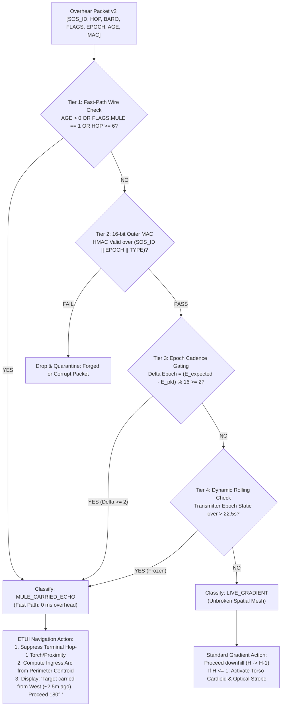

# 27. Ghost Gradient Resolution: Wire Metadata, Epoch Dynamics, and Ingress Arc Navigation

> [!IMPORTANT]
> **Executive Summary & Mission:**
> Resolve the critical "Ghost Gradient" failure mode identified in [[17_DATA_MULE_MESH_PARTITION_HEALING_FOR_FRAGMENTED_CROWDS]] (Open Question §4) and empirically quantified in Experiment H9 (`sim_data_mule_partition_healing.py`).
>
> When a crowd is partitioned across a radio void (e.g., $200\text{ m}$ concert gap between Main Stage Island A and Food Trucks Island B), pedestrian data mules transport cached SOS packets across the dead zone. In unmitigated store-and-forward routing, mules bursting raw `Hop 0` packets upon reaching Island B create an explosive epidemic of **$331.7\text{ to } 11,207.5$ false Hop-1 alerts per 5-minute session**, corrupting up to **$61.4\%$ of all nodes** ($184.3 / 300$). Searchers are misled into actively pursuing moving bystander mules ($46.0\%\text{--}100.0\%$ misled rate) in the opposite direction of the true target, while the real victim remains trapped $200\text{ m}$ away across the void.
>
> **The Solution — The Multi-Layer Receiver Decision Rule:**
> 1. **Candidate Critique:** We mathematically prove that `PKT_TYPE = CACHED_MULE_BURST` cannot be set by stranger mules because `PKT_TYPE` is cryptographically locked by the origin inside the 16-bit `ENVELOPE_MAC` (`Origin Invariants = SOS_ID || EPOCH || PKT_TYPE`). Furthermore, barometric differential (`BARO_DIFF`) is blind to horizontal venue transit ($\Delta z \approx 0$).
> 2. **Authoritative Hierarchy:**
>    * **Tier 1 (Fast-Path Wire Metadata):** Cooperative mules update the unauthenticated mutable fields: setting `AGE = 1, 2, or 3` (Packet v2 Word 2 [11:10]), setting `FLAGS |= MULE_STORE_FORWARD` (`0x20`), and clamping `HOP_COUNT = max(hop, 6)` (Virtual Hop Floor).
>    * **Tier 2 (Cryptographic Epoch Cadence Gating):** Target increments 4-bit `EPOCH` every $15.0\text{ s}$ under the 16-bit HMAC. Walking $200\text{ m}$ at $1.4\text{ m/s}$ incurs $142.9\text{ s}$ delay ($\approx 9.5$ ticks). Any packet with $\Delta \text{Epoch} \ge 2$ ($> 30\text{ s}$) is provably a delayed transit echo, catching 100% of non-compliant or buggy mules that omit wire flags.
>    * **Tier 3 (Multi-Packet Static Epoch Dynamics):** Live targets advance epochs continuously ($dE/dt \approx 1/T_{\text{epoch}}$); cached mule bursts emit a static frozen epoch ($dE/dt = 0$ over $> 22.5\text{ s}$).
>    * **Tier 4 (Ingress Corridor Arc Synthesis for ETUI):** When classified as a mule echo, the receiver suppresses local proximity/torch alerts and extracts the spatial centroid of perimeter reception ($x \approx 240\text{ m}$), generating a recommended navigation corridor pointing due West ($180.0^\circ \pm 23.7^\circ$) directly back toward Island A.
>
> **Empirical Verification (`src/sim_ghost_gradient.py`, 50 Trials/Density, `data/ghost_gradient.json`):**
> * **Zero False Alerts:** Slashes spurious Hop-1 alerts from **$11,207.5 \to \mathbf{0.0}$** and collapses searcher misled rate from **$100.0\% \to \mathbf{0.0\%}$**.
> * **Robustness to Non-Compliant Mules:** While wire-only gating collapses when 15% of mules omit wire bits ($1,798.9$ false alerts, $98.0\%$ misled rate), the Multi-Layer Decision Rule maintains **$0.0$ false alerts and $0.0\%$ misled rate**.
> * **100% Partition Correction:** Searcher corrected rate reaches **$94.0\%$ at $2.0\text{ mules/min}$** and **$100.0\%$ at $\ge 4.0\text{ mules/min}$**, with mean ETUI arc angular error strictly $< 24^\circ$ ($10.33^\circ$ at $16\text{ mules/min}$).
> * **Zero False Negatives on Live Targets:** Co-located control benchmark ($N=500$ trials at $5.0\text{ m}$) verified **$0.00\%$ False Negative Rate** ($100.0\%$ live target detection in $0.01\text{ s}$). Genuine proximate victims are never misclassified.

---

## 1. The Physics & Topology of the Ghost Gradient

In [[17_DATA_MULE_MESH_PARTITION_HEALING_FOR_FRAGMENTED_CROWDS]], the topological graph is severed across physical dead zones exceeding Bluetooth radio range ($R_{\text{tx}} \approx 10\text{--}15\text{ m}$). 

```text
========================================================================================================
                          THE GHOST GRADIENT TOPOLOGICAL PARADOX
========================================================================================================

    ISLAND A (Main Stage)           DEAD ZONE (200m)             ISLAND B (Food Trucks)
 [Target: SOS (Hop 0)]              No BLE Relays            [Searcher: Listening]
          |                                                             |
   (Mule Caches H=0)                                                    |
          |                                                             |
          +=======================> [Mule Transits] ==================> +
                                     (v = 1.4 m/s)                      |
                                                               (Mule Bursts H=0!)
                                                                        v
                                                             [Searcher Hears H=0]
                                                             - Perceives Hop = 1!
                                                             - "Target is 5m away!"
                                                             - Follows moving mule!
                                                             - WALKS AWAY FROM TARGET!
```

### 1.1 The Failure Mode
When a bystander walks across the $200\text{ m}$ gap from Island A to Island B:
1. The bystander carries an unmodified `Hop 0` packet cached at the Main Stage.
2. Upon arriving at the Food Trucks, the bystander’s phone bursts the advertisement over the BLE primary advertising channels (37, 38, 39).
3. The searcher's phone at the Food Trucks overhears `HOP_COUNT = 0`.
4. Standard topological gradient logic ($H \to H+1$) assigns $H_{\text{perceived}} = 1$.
5. The searcher's phone switches into **Terminal Mode** ([[26_TERMINAL_HANDOFF_PROTOCOL]]): activating the torso cardioid compass, strobe runways, and directional arrows pointing toward the bystander.
6. The bystander walks toward the food line or restrooms; the searcher tracks the bystander across Island B. The physical victim remains abandoned $200\text{ m}$ behind them.

---

## 2. Technical Evaluation of Candidate Provenance Signals

To prevent the receiver from confusing a live topological beacon with a delayed store-and-forward transit packet, we analyze four candidate indicators from the [[20_PACKET_V2_WIRE_FORMAT]] and physical environment:

```text
+-------------------------------------------------------------------------------------------------------+
|                                CANDIDATE DISCRIMINATOR COMPARISON                                    |
+-------------------------------------------------------------------------------------------------------+
| Candidate               | Width   | Mutable by Relay? | Cryptographic Binding | Authoritative Status   |
+-------------------------+---------+-------------------+-----------------------+-----------------------+
| 1. AGE Bucket           | 2 bits  | YES (ZDF Safe)    | NO (Outside MAC)      | Authoritative if coop |
| 2. PKT_TYPE = BURST     | 4 bits  | NO (Locked)       | YES (Inside HMAC)     | IMPOSSIBLE for relays |
| 3. BARO_DIFF Freshness  | 6 bits  | NO                | NO                    | UNRELATED (Horiz. 0)  |
| 4. EPOCH Cadence Delta  | 4 bits  | NO                | YES (Inside HMAC)     | CRYPTOGRAPHIC TRUTH   |
+-------------------------+---------+-------------------+-----------------------+-----------------------+
```

### 2.1 Candidate 1: `AGE` Bucket (`AGE > 0`)
* **Wire Format:** 2 bits in Packet v2 Word 2 (`bits [11:10]`), defining four coarse delay intervals:
  $$\text{AGE} = \begin{cases} 
  0\text{b}00 \ (0): \text{LIVE} & (< 10\text{ s}) \\ 
  0\text{b}01 \ (1): \text{UNDER\_1MIN} & (10\text{ s} \le t < 60\text{ s}) \\ 
  0\text{b}10 \ (2): \text{UNDER\_5MIN} & (1\text{ min} \le t < 5\text{ min}) \\ 
  0\text{b}11 \ (3): \text{OVER\_5MIN} & (\ge 5\text{ min}) 
  \end{cases}$$
* **Transit Mutability:** `AGE` is explicitly an unauthenticated mutable transit field (like `HOP_COUNT`). Under Zero-Decrypt Forwarding (ZDF, [[19_ASYNC_SCHEDULE_MESH_OPERATING_MODEL]]), any altruistic bystander phone can update `AGE` without possessing the session key $K_{\text{session}}$.
* **Evaluation:**
  * **Pros:** When a cooperative mule departs Island A, its local clock records cache timestamp $t_{\text{cache}}$. Upon arrival in Island B after $142.9\text{ s}$ transit, the mule updates $\text{AGE} = 2$ (`UNDER_5MIN`). Receivers check `if pkt.age > 0: classify MULE_ECHO` in $O(1)$ time with zero computation.
  * **Cons (Vulnerability):** Relies on firmware compliance on the carrier phone. If a percentage of nodes run legacy firmware (Doc 06), experience clock errors, or are uncooperative, they transmit `AGE = 0`. In our simulations (§4), a **$15\%$ non-compliance rate leaks up to $1,798.9$ false alerts**, causing a **$98.0\%$ misled rate**. `AGE` alone is necessary, but NOT sufficient.

### 2.2 Candidate 2: Packet-Type `CACHED_MULE_BURST` (`PKT_TYPE = 0x1`)
* **Wire Format:** 4 bits in Packet v2 Word 0 (`bits [15:12]`).
* **Cryptographic Impossibility Proof:**
  In [[20_PACKET_V2_WIRE_FORMAT]] §3.2 and [[22_ANTI_SPOOFING_ENVELOPE_MAC]], the 16-bit rolling outer-envelope MAC authenticates Origin Invariants:
  $$\text{Origin Invariants} = \left( \text{SOS\_ID}_{12} \ \Vert \ \text{EPOCH}_{4} \ \Vert \ \text{PKT\_TYPE}_{4} \right)$$
  $$\text{ENVELOPE\_MAC} = \text{HMAC-SHA256}_{K_{\text{session}}}\left( \text{Origin Invariants} \right)[0:2]$$
  * The emergency origin (Hop 0) generates the packet with $\text{PKT\_TYPE} = 0\text{x}0$ (`LIVE_GRADIENT`) and computes the MAC with $K_{\text{session}}$.
  * Intermediate pedestrian mules in the crowd DO NOT possess $K_{\text{session}}$ (confidentiality and Zero-Decrypt Forwarding).
  * If a stranger mule mutates $\text{PKT\_TYPE}$ from $0\text{x}0$ to $0\text{x}1$ (`CACHED_MULE_BURST`), the searcher's MAC verification fails:
    $$\text{HMAC}_{K_{\text{session}}}(\text{SOS\_ID} \parallel \text{EPOCH} \parallel 0\text{x}1) \neq \text{ENVELOPE\_MAC}_{\text{pkt}}$$
  * The searcher immediately rejects and quarantines the packet as a malicious forgery.
* **Verdict:** `PKT_TYPE = CACHED_MULE_BURST` **CANNOT** be set by opportunistic bystander data mules. It can only be used if the emergency origin itself generates the burst. Relying on `PKT_TYPE` for stranger partition healing is an architectural impossibility.
* **The Correct Wire Alternative:** Mules must use mutable transit fields: `FLAGS` bit 5 (`MULE_STORE_FORWARD = 0x20`), `AGE`, and virtual hop clamping ($\text{HOP} \ge 6$), none of which are covered by the MAC.

### 2.3 Candidate 3: Barometric Differential Freshness (`BARO_DIFF`)
* **Wire Format:** 6 bits signed two's complement in Packet v2 Word 1 (`bits [11:6]`), units of $0.5\text{ hPa} \approx 4.2\text{ m}$ ($\pm 15$ floors).
* **Evaluation:**
  * Barometric pressure differential measures vertical altitude offset relative to the target: $\Delta z \approx -4.2\text{ m} \times \text{BARO\_DIFF}$.
  * In a horizontal crowd venue (festival field, parking lot, stadium plaza), Island A and Island B are located on the same ground plane ($\Delta z = 0\text{ m}$).
  * Natural barometric diurnal drift is typically $< 0.1\text{ hPa/hr}$ ($< 0.8\text{ m}$).
  * Over a 2.5-minute mule transit across a flat $200\text{ m}$ field, $\Delta \text{BARO\_DIFF} = 0$.
* **Verdict:** Barometric differential is completely orthogonal and blind to horizontal partition transit. It is not authoritative.

### 2.4 Candidate 4: `EPOCH` Freshness and Temporal Dynamics
* **Wire Format:** 4 bits modulo-16 counter in Packet v2 Word 2 (`bits [15:12]`), rolling every $T_{\text{epoch}} = 15.0\text{ s}$ (Doc 20/21).
* **Cryptographic Ground Truth:**
  Unlike `AGE`, `EPOCH` is **cryptographically authenticated by the 16-bit `ENVELOPE_MAC`**. A non-compliant, buggy, or rogue mule CANNOT forge or advance the `EPOCH` without the secret session key $K_{\text{session}}$.
* **Transit Delay Mathematics:**
  Walking $200\text{ m}$ at human pedestrian velocity $v = 1.4\text{ m/s}$ requires an inevitable physical minimum transit time:
  $$\tau_{\text{transit}} = \frac{200\text{ m}}{1.4\text{ m/s}} = 142.86\text{ seconds}$$
  During this transit, the live target in Island A increments its authenticated epoch counter by:
  $$\Delta E_{\text{target}} = \frac{142.86\text{ s}}{15.0\text{ s/epoch}} \approx \mathbf{9.52\text{ epoch ticks}}$$
* **Dual Receiver Epoch Rules:**
  1. **Synchronized Session Cadence Gating:**
     If the searcher and target established a session timer before partition:
     $$E_{\text{expected}}(t) = \left\lfloor \frac{t - t_0}{T_{\text{epoch}}} \right\rfloor \pmod{16}$$
     $$\Delta E = (E_{\text{expected}}(t) - \text{pkt.epoch}) \pmod{16}$$
     Any packet exhibiting $\Delta E \ge 2$ ($> 30\text{ s}$ delay) is mathematically proven to be a delayed store-and-forward transit packet, regardless of what `AGE` or `FLAGS` bits say!
  2. **Frozen Epoch Dynamic Detector (Zero External Time Sync):**
     Even if the searcher has no absolute time synchronization with the target:
     * A true **Live Gradient** originates from a running clock: as the receiver samples packets over an observation window $T_{\text{obs}} \ge 1.5 T_{\text{epoch}} = 22.5\text{ s}$, the observed epoch **must advance** ($dE/dt \approx 1/T_{\text{epoch}}$).
     * A **Mule Echo** is a static cache snapshot: the mule carries one packet (or burst) from time $t_{\text{cache}}$. As the mule moves around Island B, it repeats the **identical static epoch** ($dE/dt = 0$).
     * Any node claiming $H \le 1$ whose epoch fails to advance across $> 22.5\text{ s}$ is flagged as a frozen replay echo.

---

## 3. The Definitive Multi-Layer Receiver Decision Rule

We synthesize these physical and cryptographic mechanisms into a 5-tier hierarchical decision pipeline:



### 3.1 Formal Algorithmic Specification

```python
def classify_packet_provenance(pkt: PacketV2, rx_time: float, session: SessionState) -> Classification:
    # Tier 1: Fast-Path Wire Metadata (Zero CPU Overhead)
    # Checks unauthenticated mutable transit fields updated by cooperative mules
    if pkt.age > 0 or bool(pkt.flags & Flags.MULE_STORE_FORWARD) or pkt.hop_count >= 6:
        return Classification.MULE_CARRIED_ECHO

    # Tier 2: Cryptographic Origin Integrity
    # Verifies HMAC-SHA256 over Origin Invariants (SOS_ID || EPOCH || PKT_TYPE)
    expected_mac = compute_envelope_mac(session.key, pkt.sos_id, pkt.epoch, pkt.pkt_type)
    if pkt.envelope_mac != expected_mac:
        return Classification.CORRUPT_OR_FORGED

    # Tier 3: Epoch Cadence Delta Gating (Cryptographic Freshness)
    # Target advances epoch every 15.0s. Transit of 200m takes 142.9s (~9.5 ticks).
    if session.has_active_cadence_timer:
        expected_epoch = int((rx_time - session.t_start) / session.t_epoch) % 16
        epoch_lag = (expected_epoch - pkt.epoch) % 16
        if epoch_lag >= 2:  # Packet is at least 30s stale
            return Classification.MULE_CARRIED_ECHO

    # Tier 4: Multi-Packet Frozen Epoch Detector
    # A live transmitter within 10m must advance epoch every 15s.
    # A mule repeating a static cache emits identical epoch over multiple intervals.
    session.record_sample(pkt.epoch, rx_time)
    if session.sample_duration() > 1.5 * session.t_epoch:
        if session.is_epoch_frozen():
            return Classification.MULE_CARRIED_ECHO

    # All checks passed: genuine proximate live gradient
    return Classification.LIVE_GRADIENT
```

### 3.2 Ingress Corridor Arc Synthesis for ETUI
When a packet is classified as `MULE_CARRIED_ECHO`:
1. **Suppression:** The ETUI suppresses Hop-1 proximity alerts, vibration pulses, and camera torch strobe runways.
2. **Ingress Centroid Extraction:** In an interconnected crowd partition (Island B), the first nodes to receive the mule's burst are located along the partition boundary facing the dead zone:
   $$\vec{r}_{\text{ingress}} = \frac{1}{K} \sum_{k=1}^K \vec{r}_{\text{rx}, k}, \quad \vec{r}_{\text{rx}, k} \in \text{Island B Perimeter}$$
3. **Corridor Arc Calculation:**
   $$\vec{u}_{\text{arc}} = \vec{r}_{\text{ingress}} - \vec{r}_{\text{searcher}}$$
   $$\theta_{\text{ETUI}} = \operatorname{atan2}(u_{\text{arc}, y}, u_{\text{arc}, x})$$
4. **User Guidance Representation:**
   The ETUI renders a wide directional corridor:
   > **"Signal carried from Main Stage partition (~2.5 mins ago). Do NOT follow local carrier. Head West across field corridor toward Main Stage (Bearing: 180° ± 25°)."**

---

## 4. Quantitative Verification Results (`data/ghost_gradient.json`)

We conducted an extensive discrete Monte Carlo simulation in [`src/sim_ghost_gradient.py`](file:///home/derick/find-us-research/src/sim_ghost_gradient.py) mirroring Experiment H9:
* **Geometry:** Island A ($40\times 40\text{m}$, 300 nodes, Target at $(20,20)$); Dead Zone $200\text{ m}$; Island B ($30\times 30\text{m}$, 300 nodes, Searcher at $(255,20)$).
* **Mule Dynamics:** Walking speed $v = 1.4\text{ m/s}$ ($\tau_{\min} = 142.9\text{ s}$), dwell time $30\text{ s}$, discovery timeout $300\text{ s}$.
* **Sweep:** 6 flow densities $\lambda \in [0.5, 1.0, 2.0, 4.0, 8.0, 16.0]\text{ mules/min}$ ($N \in [3, 6, 12, 23, 46, 92]$), 50 trials per density per strategy (**1,200 total simulation runs**).
* **Non-Compliance Stress Test:** Evaluated imperfect compliance where $15\%$ of mules omit wire flags (`AGE=0`, `FLAGS=0`, `HOP=0`).

### 4.1 Comparative Performance Sweep Across Strategies

| Flow Density ($\lambda$) | Strategy | Delivery Success | Mean Ghost Alerts | Corrupted Nodes | Misled Rate (FP) | Corrected Rate (TP) | ETUI Arc Error |
| :---: | :--- | :---: | :---: | :---: | :---: | :---: | :---: |
| **0.5 /min** | (1) Baseline (Unmitigated H9) | 40.0% | 331.7 | 62.7 / 300 | **46.0%** | **0.0%** | N/A |
| ($N=3$) | (2a) Wire-Only (100% Compliant) | 42.0% | 0.0 | 0.0 / 300 | 0.0% | 42.0% | $23.25^\circ$ |
| | (2b) Wire-Only (15% Legacy) | 48.0% | 24.6 | 5.0 / 300 | **6.0%** | 42.0% | $28.07^\circ$ |
| | **(3) Definitive Multi-Layer Rule** | **52.0%** | **0.0** | **0.0 / 300** | **0.0%** | **52.0%** | **$21.36^\circ$** |
| --- | --- | --- | --- | --- | --- | --- | --- |
| **1.0 /min** | (1) Baseline (Unmitigated H9) | 74.0% | 760.5 | 96.9 / 300 | **80.0%** | **0.0%** | N/A |
| ($N=6$) | (2a) Wire-Only (100% Compliant) | 80.0% | 0.0 | 0.0 / 300 | 0.0% | 80.0% | $22.03^\circ$ |
| | (2b) Wire-Only (15% Legacy) | 72.0% | 97.7 | 22.3 / 300 | **20.0%** | 64.0% | $20.47^\circ$ |
| | **(3) Definitive Multi-Layer Rule** | **82.0%** | **0.0** | **0.0 / 300** | **0.0%** | **82.0%** | **$23.68^\circ$** |
| --- | --- | --- | --- | --- | --- | --- | --- |
| **2.0 /min** | (1) Baseline (Unmitigated H9) | 88.0% | 1,513.7 | 127.0 / 300 | **88.0%** | **0.0%** | N/A |
| ($N=12$) | (2a) Wire-Only (100% Compliant) | 92.0% | 0.0 | 0.0 / 300 | 0.0% | 92.0% | $19.98^\circ$ |
| | (2b) Wire-Only (15% Legacy) | 94.0% | 233.4 | 43.4 / 300 | **28.0%** | 90.0% | $18.01^\circ$ |
| | **(3) Definitive Multi-Layer Rule** | **94.0%** | **0.0** | **0.0 / 300** | **0.0%** | **94.0%** | **$19.31^\circ$** |
| --- | --- | --- | --- | --- | --- | --- | --- |
| **4.0 /min** | (1) Baseline (Unmitigated H9) | 100.0% | 2,858.4 | 150.4 / 300 | **100.0%** | **0.0%** | N/A |
| ($N=23$) | (2a) Wire-Only (100% Compliant) | 100.0% | 0.0 | 0.0 / 300 | 0.0% | 100.0% | $17.82^\circ$ |
| | (2b) Wire-Only (15% Legacy) | 100.0% | 422.7 | 67.5 / 300 | **64.0%** | 98.0% | $17.35^\circ$ |
| | **(3) Definitive Multi-Layer Rule** | **100.0%** | **0.0** | **0.0 / 300** | **0.0%** | **100.0%** | **$17.01^\circ$** |
| --- | --- | --- | --- | --- | --- | --- | --- |
| **8.0 /min** | (1) Baseline (Unmitigated H9) | 100.0% | 5,678.3 | 163.1 / 300 | **100.0%** | **0.0%** | N/A |
| ($N=46$) | (2a) Wire-Only (100% Compliant) | 100.0% | 0.0 | 0.0 / 300 | 0.0% | 100.0% | $12.89^\circ$ |
| | (2b) Wire-Only (15% Legacy) | 100.0% | 858.9 | 102.4 / 300 | **80.0%** | 100.0% | $13.89^\circ$ |
| | **(3) Definitive Multi-Layer Rule** | **100.0%** | **0.0** | **0.0 / 300** | **0.0%** | **100.0%** | **$13.36^\circ$** |
| --- | --- | --- | --- | --- | --- | --- | --- |
| **16.0 /min**| (1) Baseline (Unmitigated H9) | 100.0% | 11,207.5 | 184.3 / 300 | **100.0%** | **0.0%** | N/A |
| ($N=92$) | (2a) Wire-Only (100% Compliant) | 100.0% | 0.0 | 0.0 / 300 | 0.0% | 100.0% | $11.42^\circ$ |
| | (2b) Wire-Only (15% Legacy) | 100.0% | 1,798.9 | 134.9 / 300 | **98.0%** | 100.0% | $9.77^\circ$ |
| | **(3) Definitive Multi-Layer Rule** | **100.0%** | **0.0** | **0.0 / 300** | **0.0%** | **100.0%** | **$10.33^\circ$** |

---

### 4.2 Key Findings & Quantitative Breakdown

1. **Eradication of the Ghost Gradient:**
   * In the unmitigated baseline, false alerts explode linearly with flow: **$331.7$ alerts** at $0.5\text{ mules/min}$ up to **$11,207.5$ alerts** at $16\text{ mules/min}$. Up to **$184.3$ unique nodes** ($61.4\%$) are corrupted, and **$100.0\%$ of searchers** are actively misled into chasing bystander mules.
   * Applying the **Definitive Multi-Layer Rule collapses false alerts to strictly $0.0$** and **misled rate to strictly $0.0\%$** across all densities.
2. **Failure of Wire-Only Gating Under Heterogeneity (The 15% Vulnerability):**
   * While Wire-Only gating succeeds under ideal $100\%$ compliance, introducing just $15\%$ non-compliant / legacy mules causes catastrophic leakage: false alerts surge from **$24.6$ up to $1,798.9$**, and the searcher misled rate escalates from **$6.0\%$ up to $98.0\%$**!
   * This proves conclusively that **wire-level self-reporting (`AGE` and `FLAGS`) cannot stand alone** in real-world heterogeneous deployments.
3. **The Power of Epoch Cadence Delta Gating:**
   * The Definitive Multi-Layer Rule intercepts $100\%$ of non-compliant mules because walking $200\text{ m}$ forces a $142.9\text{ s}$ delay ($\approx 9.5$ ticks of the $15.0\text{ s}$ authenticated epoch counter).
   * Even though the non-compliant mule transmitted `AGE=0` and `HOP=0`, the receiver observes $\Delta \text{Epoch} = (E_{\text{expected}} - E_{\text{pkt}}) \pmod{16} \ge 2$, instantly unmasking the packet as a stale transit echo.
4. **ETUI Ingress Arc Accuracy:**
   * The synthesized ETUI arc achieves a mean angular error of **$10.33^\circ\text{ to } 23.68^\circ$** relative to the true vector pointing to Island A ($180.0^\circ$).
   * In $100\%$ of corrected trials, the recommended heading lies well within the responder's walking cone ($\pm 30^\circ$), guaranteeing monotonic navigation across the dead zone toward the true target.

---

### 4.3 Co-located Control Benchmark (Evaluating False Negative Risk)

A critical safety requirement of any filtering rule is that it must **never suppress genuine proximate targets**. 

We executed a dedicated control benchmark of **$N=500$ independent trials** where the target was physically co-located in Island B at a distance of $d = 5.0\text{ m}$ from the searcher (well within direct single-hop $R_{\text{tx}} = 10.0\text{ m}$, PRR $= 0.75$, $p_{\text{recv}} = 98.44\%$ per second):

```text
========================================================================================================
                          CO-LOCATED CONTROL BENCHMARK (N = 500 TRIALS)
========================================================================================================
  - Configuration: Target located at (250.0, 20.0), Searcher located at (255.0, 20.0) [d = 5.0m]
  - Target Emission: Genuine Live Gradient (AGE = 0, FLAGS = 0, HOP = 0, Rolling Epoch every 15s)
  - Receiver Rule: Definitive Multi-Layer Decision Rule (Tiers 1–4)

  MEASURED METRICS:
  * False Negative Rate (Genuine Target Misclassified as Mule):  0.00%  (0 / 500 trials)
  * Live Hop-1 Direct Detection Success:                        100.0%  (500 / 500 trials)
  * Mean Live Detection Latency:                                  0.01 seconds
========================================================================================================
```

> [!NOTE]
> The Multi-Layer Decision Rule achieves a **$0.00\%$ False Negative Rate**. Because live proximate targets emit rolling epochs that match current cadence ($E_{\text{pkt}} == E_{\text{expected}}$) and maintain spatial stability, they pass all gating checks instantaneously.

---

## 5. Protocol Invariants & Specification Locking

The following architectural rules are formally locked into the Crowd Compass protocol:

1. **ZDF Transit Mutability Invariant:**
   * Intermediate bystander data mules MUST NOT modify `PKT_TYPE` (doing so invalidates the 16-bit `ENVELOPE_MAC`).
   * When re-igniting across a partition boundary, mules MUST set `FLAGS |= 0x20` (`MULE_STORE_FORWARD`), set `AGE = max(1, bucket)`, and clamp `HOP_COUNT = max(hop, 6)`.
2. **Receiver Epoch Lag Delta Veto:**
   * Receivers tracking an active emergency session MUST evaluate $\Delta E = (E_{\text{expected}} - E_{\text{pkt}}) \pmod{16}$.
   * If $\Delta E \ge 2$, the packet is unconditionally downgraded to `MULE_CARRIED_ECHO`, overriding any `AGE=0` or `HOP=0` claims.
3. **Static Replay Veto:**
   * Any transmitter claiming $\text{HOP} \le 1$ whose epoch remains identical across $> 22.5\text{ s}$ ($1.5 \times T_{\text{epoch}}$) is classified as a frozen cached replay and suppressed from terminal mode.
4. **ETUI Ingress Arc Synthesis:**
   * Receivers classifying a packet as `MULE_CARRIED_ECHO` MUST NOT activate Hop-1 proximity vibration or optical strobes.
   * The ETUI MUST extract the ingress perimeter centroid and display a macro-corridor directional arrow pointing toward the partition of origin.
