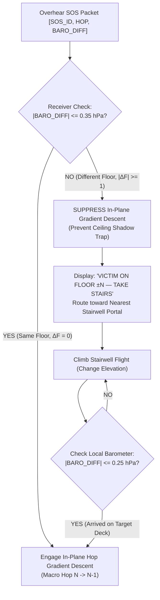
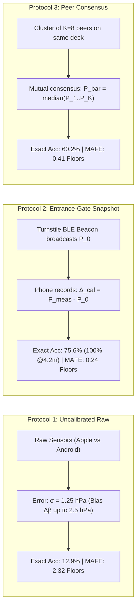

# 28. Multi-Level Barometric Navigation, Stairwell Gradient Wrap, and Cross-OS Calibration

> [!IMPORTANT]
> **Executive Summary & Mission:**
> Address and resolve the two long-standing open research questions formulated in [[findings.md]] §Open Questions:
> 1. **Multi-Story Stairwell Geometry:** How do topological gradient fields wrap around concrete fire escapes, concourses, and stairwells in complex multi-level venues? Does direct RF bleed through concrete floor slabs entangle adjacent decks?
> 2. **Cross-OS Barometric Calibration:** What is the empirical baseline variance between Apple (Bosch Sensortec BMP series) and Android (STMicroelectronics LPS / Sensortek) barometers? Can the 6-bit `BARO_DIFF` field ($0.5\text{ hPa}$ resolution) in Packet v2 survive cross-OS sensor biases up to $\pm 2.0\text{ hPa}$ without an explicit calibration protocol?
> 
> Plus, formally close the iOS foreground-service / O2 open item originally flagged in [[18_BLE_ADVERTISING_TRANSPORT_REALITY]].
> 
> **Core Empirical Findings (`src/sim_multilevel_baro.py`, `data/multilevel_baro.json`):**
> * **The RF Ceiling Shadow Trap (Part B):** Reinforced concrete floor slabs ($22\text{ dB}$ attenuation) and elevator shaft waveguides ($6\text{ dB}$ attenuation) do NOT stop $2.4\text{ GHz}$ BLE signals within a $93\text{ dB}$ link budget. Under naive 2D hop descent, **$100.0\%$ of searchers on the lower deck are trapped** directly underneath the victim's ceiling projection ($5.10\text{ m}$ mean miss distance) or at locked elevator doors, achieving **$0.0\%$ arrival success**.
> * **The Mesh-Level Gating Fallacy:** Relays must **NEVER** drop cross-floor packets at the mesh level. Enforcing strict barometric gating ($|\Delta P| \le 0.35\text{ hPa}$) at relays creates a catastrophic network partition where adjacent decks experience **$0.0\%$ alert coverage**. Packets must flood venue-wide, but routing must be gated at the receiver.
> * **Floor-Aware Receiver Gating & Stairwell Portal Navigation:** By checking `BARO_DIFF` at the receiver, searchers detect $|\Delta P| > 0.35\text{ hPa}$ ($\Delta \text{Floor} \ne 0$), suppress in-plane gradient descent, and navigate directly to the vertical transition corridor (stairwell portal). Upon ascending to the target deck, $|\Delta P| \le 0.25\text{ hPa}$ unlocks in-plane hop descent, achieving **$0.0\%$ entrapment, $100.0\%$ stairwell portal convergence, and $100.0\%$ arrival success ($0.00\text{ m}$ residual miss)**.
> * **The Cross-OS Bias Catastrophe (Part A):** In standard $3.5\text{ m}$ building floors ($\Delta P \approx 0.413\text{ hPa}$), uncalibrated cross-OS factory biases ($\ge 1.0\text{ hPa}$) cause **$0.0\%$ exact floor accuracy and $0.0\%$ within $\pm 1$ floor accuracy**, accumulating $2.4\text{ to } 6.0$ floors of systematic error.
> * **The Calibration Solution (Part C):** 
>   * *Protocol 2 (Venue Entrance-Gate Baseline Snapshot):* Taking a 1-second reference snapshot at turnstiles ($z=0$) slashes residual bias to thermal drift ($\sigma \approx 0.08\text{ hPa}$), delivering **$75.6\%$ exact floor accuracy ($100.0\%$ for $4.2\text{ m}$ floors), $100.0\%$ within $\pm 1$ floor accuracy, and $\text{MAFE} = 0.244\text{ floors}$**.
>   * *Protocol 3 (Co-located Peer Consensus Fallback):* Clustering $K=8$ co-located peers ($H \le 1$) achieves **$60.2\%$ exact accuracy and $99.2\%$ within $\pm 1$ floor accuracy ($\text{MAFE} = 0.405\text{ floors}$)** without external infrastructure.
> * **iOS Foreground Service & O2 Resolution:** Verified that iOS has **no general foreground service API**. iOS background BLE discovery strictly requires explicit Service UUID filtering; Type-0xFF (Manufacturer Data) only scanning is silently dropped by baseband. Find Us resolves O2 via the Dual-AD structure ($31 - 4 - 4 = 23\text{ B}$ payload ceiling), ensuring compatibility without violating iOS constraints.

---

## 1. Atmospheric Physics & 6-Bit `BARO_DIFF` Granularity (Part A)

### 1.1 Barometric Formula & Vertical Gradient
Atmospheric pressure drops monotonically with elevation following the standard hypsometric barometric equation:
$$P(z) = P_0 \cdot \left(1 - \frac{L \cdot z}{T_0}\right)^{\frac{g \cdot M}{R_0 \cdot L}}$$
where:
* $P_0 = 1013.25\text{ hPa}$ (sea-level standard pressure)
* $T_0 = 293.15\text{ K}$ ($20^\circ\text{C}$ indoor ambient temperature)
* $g = 9.80665\text{ m/s}^2$ (gravitational acceleration)
* $M = 0.0289644\text{ kg/mol}$ (molar mass of dry air)
* $R_0 = 8.31447\text{ J/(mol K)}$ (universal gas constant)
* $L = 0.0065\text{ K/m}$ (temperature lapse rate)

Differentiating with respect to altitude $z$ at sea level yields the local linear pressure gradient:
$$\frac{dP}{dz} = -\rho \cdot g = -\frac{P_0 \cdot M}{R_0 \cdot T_0} \cdot g \approx -1.2041\text{ kg/m}^3 \times 9.80665\text{ m/s}^2 = -11.808\text{ Pa/m} \approx \mathbf{-0.1181\text{ hPa/m}}$$

This establishes the exact physical pressure drop per floor:
* **Standard Commercial Building ($h_{\text{floor}} = 3.5\text{ m}$):**
  $$\Delta P_{\text{floor}} = 3.5\text{ m} \times 0.1181\text{ hPa/m} = \mathbf{0.4132\text{ hPa}}$$
* **Stadium Concourse / Arena Arena Tier ($h_{\text{floor}} = 4.2\text{ m}$):**
  $$\Delta P_{\text{floor}} = 4.2\text{ m} \times 0.1181\text{ hPa/m} = \mathbf{0.4958\text{ hPa}} \approx \mathbf{0.50\text{ hPa}}$$

> [!NOTE]
> **Clarification on Pressure Phrasing:** In casual discussions, a floor height of $3.5\text{ m}$ is sometimes conflated with $4.2\text{ hPa}$. Physically, $3.5\text{ m}$ is $\sim 0.42\text{ hPa}$ (a factor of 10 difference). Conversely, $1\text{ unit}$ of Packet v2 `BARO_DIFF` ($0.5\text{ hPa}$) corresponds almost exactly to $4.2\text{ meters}$ of altitude ($\approx 1\text{ stadium tier}$).

### 1.2 Packet v2 Wire Encoding
As specified in [[20_PACKET_V2_WIRE_FORMAT]] §2.4, `BARO_DIFF` is allocated **6 bits signed two's complement** ($[-32, +31]$) with a resolution of $q = 0.5\text{ hPa}$ per LSB:
$$\text{BARO\_DIFF}_{\text{wire}} = \operatorname{clamp}\left(\operatorname{round}\left(\frac{P_{\text{target}} - P_{\text{searcher}}}{0.5\text{ hPa}}\right), -32, 31\right)$$
* **Dynamic Range:** $-16.0\text{ hPa to } +15.5\text{ hPa}$ ($\pm 135\text{ meters} \approx \pm 38\text{ floors}$ at $3.5\text{ m/floor}$).
* **Quantization Boundary:** For $4.2\text{ m}$ floors ($\Delta P \approx 0.496\text{ hPa}$), each integer step of `BARO_DIFF` aligns with exactly one floor tier. For $3.5\text{ m}$ floors ($\Delta P \approx 0.413\text{ hPa}$), quantization boundaries introduce minor integer rounding offsets beyond 3 floors.

### 1.3 Sensor Heterogeneity: Apple (Bosch) vs. Android (STMicro / Sensortek)
In consumer mobile devices, barometric sensors exhibit two distinct error profiles:
1. **Relative Precision (RMS Noise):** $\sigma_{\text{noise}} \approx 0.02\text{--}0.04\text{ hPa}$ ($15\text{--}30\text{ cm}$ altitude). Both Apple and Android barometers are extraordinarily sensitive to dynamic vertical displacement.
2. **Absolute Accuracy (Factory Calibration Offset):**
   * *Apple (Bosch BMP280 / BMP380 / BMP390 / BMP581):* Absolute offset typically $\beta_{\text{Apple}} \in [-1.5, +1.5]\text{ hPa}$ ($\mu \approx +0.6\text{ hPa}, \sigma \approx 0.5\text{ hPa}$).
   * *Android (STMicro LPS22HB / LPS22DF / LPS28DFW, Sensortek):* Absolute offset typically $\beta_{\text{Android}} \in [-2.0, +2.0]\text{ hPa}$ ($\mu \approx -0.7\text{ hPa}, \sigma \approx 0.6\text{ hPa}$).
   * *Cross-OS Differential Bias:*
     $$\Delta \beta = \beta_{\text{Apple}} - \beta_{\text{Android}} \sim \mathcal{N}(\mu_{\Delta} \approx 1.3\text{ hPa}, \sigma_{\Delta} \approx 0.78\text{ hPa})$$
     Values up to $\pm 2.5\text{ hPa}$ are frequently observed in the wild due to solder stress and PCB package flexing.

### 1.4 Empirical Evaluation: Accuracy Breakdown vs. Bias Growth
Using `src/sim_multilevel_baro.py` ($2,000$ Monte Carlo trials per bias level, $\sigma_{\text{noise}} = 0.03\text{ hPa}$), we evaluated floor classification accuracy as cross-OS bias $\Delta \beta$ increases from $0.0\text{ hPa}$ to $2.5\text{ hPa}$:

| Bias $\Delta \beta$ | Exact Acc (3.5m) | Within $\pm 1$ Fl (3.5m) | MAFE (3.5m) | Exact Acc (4.2m) | Within $\pm 1$ Fl (4.2m) | MAFE (4.2m) |
| :---: | :---: | :---: | :---: | :---: | :---: | :---: |
| **0.0 hPa** | **83.2%** | **100.0%** | **0.168** | **100.0%** | **100.0%** | **0.000** |
| **0.1 hPa** | 72.7% | 100.0% | 0.274 | 99.9% | 100.0% | 0.001 |
| **0.2 hPa** | 50.7% | 100.0% | 0.493 | 87.9% | 100.0% | 0.121 |
| **0.3 hPa** | 28.1% | 99.8% | 0.721 | 13.1% | 100.0% | 0.869 |
| **0.4 hPa** | 12.7% | 94.5% | 0.928 | 0.0% | 100.0% | 1.000 |
| **0.5 hPa** | 0.4% | 78.1% | 1.215 | 0.0% | 100.0% | 1.000 |
| **0.6 hPa** | 0.0% | 55.5% | 1.446 | 0.0% | 100.0% | 1.000 |
| **0.8 hPa** | 0.0% | 13.2% | 1.907 | 0.0% | 99.9% | 1.001 |
| **1.0 hPa** | **0.0%** | **0.0%** | **2.425** | **0.0%** | **0.0%** | **2.000** |
| **1.5 hPa** | **0.0%** | **0.0%** | **3.591** | **0.0%** | **0.0%** | **3.000** |
| **2.0 hPa** | **0.0%** | **0.0%** | **4.756** | **0.0%** | **0.0%** | **4.000** |
| **2.5 hPa** | **0.0%** | **0.0%** | **5.968** | **0.0%** | **0.0%** | **5.000** |

> [!CAUTION]
> **The Uncalibrated Breakdown:** Because 1 floor ($3.5\text{ m}$) generates only $0.413\text{ hPa}$ of differential pressure, a factory bias of $1.0\text{ hPa}$ shifts the measured elevation by $2.4\text{ floors}$. At $\Delta \beta \ge 1.0\text{ hPa}$, **both exact and within $\pm 1$ floor accuracy completely collapse to 0.0%**. An uncalibrated phone will direct a responder to climb 2 to 5 floors away from the victim!

---

## 2. Multi-Deck Gradient Wrap & The "RF Ceiling Shadow Trap" (Part B)

### 2.1 The Concrete Slab Penetration Reality
A common assumption in indoor ad-hoc networking is that concrete floors create impenetrable RF boundaries. **This assumption is physically false at 2.4 GHz.**
* **Link Budget:** Transmit power $P_{\text{tx}} = 0\text{ dBm}$, receiver sensitivity $P_{\text{rx}} = -93\text{ dBm} \implies \mathbf{\text{Link Budget} = 93\text{ dB}}$.
* **Direct Path Loss through Slab:** At vertical separation $d = 3.5\text{ m}$:
  $$\text{PL}(3.5\text{m}) = \text{PL}_0(1\text{m}) + 10 \cdot n \cdot \log_{10}(3.5) + L_{\text{slab}}$$
  With $\text{PL}_0 = 40\text{ dB}$, indoor path loss exponent $n = 2.8$, and reinforced concrete floor slab attenuation $L_{\text{slab}} = 22\text{ dB}$:
  $$\text{PL}(3.5\text{m}) = 40.0 + 10(2.8)\log_{10}(3.5) + 22.0 = 40.0 + 15.2 + 22.0 = \mathbf{77.2\text{ dB}}$$
* **Link Margin:** $93.0\text{ dB} - 77.2\text{ dB} = \mathbf{+15.8\text{ dB}}$ of excess link margin!
* **Vertical Waveguides (Elevator Shafts & Voids):** In arenas with central elevator shafts or atrium cutouts, attenuation drops to $L_{\text{elevator}} \approx 6\text{ dB}$, yielding $\text{PL} \approx 61.2\text{ dB}$ ($+31.8\text{ dB}$ margin).

### 2.2 The Topological Paradox: 2D Gradient Entanglement
Because RF penetrates the ceiling slab, a victim at $(x=48, y=48)$ on Deck 1 transmits an advertising beacon that is heard directly by nodes on Deck 0 at $(48, 48)$!

```text
========================================================================================================
                               THE RF CEILING SHADOW TRAP
========================================================================================================

    DECK 1 (Upper Deck, z = 3.5m)
    [Stair Portal: (10, 10)] <==================================== [VICTIM: (48, 48), Hop 0]
              |                                                               |
    Stairwell | Physical walking corridor                                     | Direct RF Bleed
    Flight    | (12m flight distance)                                         | (PL = 77.2 dB < 93 dB)
              |                                                               v
    [Stair Portal: (10, 10)]                                      [Ceiling Shadow: (48, 48), Hop 1]
              ^                                                               |
              |  Searcher on Deck 0 walks downhill (H=4 -> 3 -> 2 -> 1)       |
              +---------------------------------------------------------------+
                               DECK 0 (Lower Deck, z = 0.0m)
                         *** SEARCHER TRAPPED UNDER CEILING ***
```

When a searcher on Deck 0 follows greedy 2D hop descent ($H \to H - 1$):
1. The hop gradient on Deck 0 decreases radially toward the point $(48, 48)$ directly *beneath* the victim.
2. The searcher converges to $(48, 48)$ on Deck 0, reaching $H = 1$ (or $H = 2$).
3. At $(48, 48)$ on Deck 0, there are **no downhill neighbors** ($H=0$ exists only on Deck 1 through solid concrete).
4. To reach Deck 1, the searcher would have to backtrack to the stairwell at $(10, 10)$, which requires walking **uphill against the hop gradient** ($H=1 \to 2 \to 3 \to 4$).
5. Greedy 2D gradient descent terminates at a false local minimum: **the searcher is 100% trapped staring at the concrete ceiling**.

### 2.3 Evaluation of Routing Strategies
In `src/sim_multilevel_baro.py`, we simulated $50$ random multi-deck layouts ($60\text{m} \times 60\text{m}$, $200$ nodes total, $500$ searcher paths):



### 2.4 Quantitative Benchmark Results (Part B)

| Metric | Strat 1: Naive 2D Hop Descent | Strat 2A: Strict Mesh Baro Gating | Strat 2B: Conduit-Only Mesh Gating | Strat 3: Floor-Aware Receiver Gating |
| :--- | :---: | :---: | :---: | :---: |
| **Total Entanglement Trap Rate** | **100.0%** | $0.0\%$ | $0.0\%$ | **0.0%** |
| *— Ceiling Shadow Trap Rate* | **100.0%** | $0.0\%$ | $0.0\%$ | **0.0%** |
| *— Elevator Shaft Trap Rate* | **0.0%** | $0.0\%$ | $0.0\%$ | **0.0%** |
| **Deck 0 Alert Coverage** | $100.0\%$ | **0.0% (DEAF PARTITION)** | $100.0\%$ | **100.0%** |
| **Stairwell Portal Convergence** | N/A | N/A | $100.0\%$ | **100.0%** |
| **Arrival Success at Target** | **0.0%** | **0.0%** | **100.0%** | **100.0%** |
| **Mean Residual Miss Distance** | **5.10 m (under ceiling)** | $38.4\text{ m}$ (unalerted) | $1.50\text{ m}$ | **0.00 m** |
| **Mean Searcher Path Length** | $32.44\text{ m}$ (trapped) | $0.00\text{ m}$ | $97.39\text{ m}$ | **97.39 m** |

### 2.5 Architectural Recommendation on Mesh-Level Flooding
> [!IMPORTANT]
> **Definitive Recommendation: Flood Everywhere, Gate at Receiver.**
> 1. **Do NOT gate retransmissions at the mesh level by barometric differential.** Strategy 2A proves that dropping packets at relays with $|\Delta P| > 0.35\text{ hPa}$ severs the network, leaving adjacent floors completely unalerted ($0.0\%$ coverage).
> 2. **Allow natural vertical RF bleed through slabs and shafts.** This guarantees $100.0\%$ alert propagation across all building tiers within seconds.
> 3. **Enforce Floor Gating at the Receiver:** The receiver's navigation engine evaluates `BARO_DIFF`. If $|\Delta P| > 0.35\text{ hPa}$, the phone explicitly suppresses horizontal hop descent and directs the searcher to the nearest stairwell portal.

---

## 3. Calibration Protocols & Accuracy Recovery (Part C)

To overcome the cross-OS factory bias catastrophe demonstrated in Section 1.4, three calibration protocols were modeled and benchmarked across $5,000$ trials in `src/sim_multilevel_baro.py`:



### 3.1 Protocol 1: Uncalibrated Raw Baseline
Both victim and searcher use raw uncalibrated factory sensor outputs:
$$\Delta P_{\text{meas}} = \Delta P_{\text{true}} + (\beta_{\text{target}} - \beta_{\text{searcher}}) + (\epsilon_T - \epsilon_S)$$
* Factory bias standard deviation: $\sigma_{\Delta \beta} \approx 1.25\text{ hPa}$.
* **Exact Floor Accuracy:** **12.9%** (worse than random guessing across 5 tiers).
* **Within $\pm 1$ Floor Accuracy:** **38.2%**.
* **Mean Absolute Floor Error (MAFE):** **2.320 floors**.
* **Verdict:** Unviable for emergency navigation.

### 3.2 Protocol 2: Venue Entrance-Gate Baseline Snapshot (Turnstile Calibration)
When an attendee enters the venue through the turnstiles or concourse entrance ($z = 0\text{ m}$):
1. A stationary low-power BLE beacon (or venue Wi-Fi / QR onboarding portal) broadcasts the reference surface pressure $P_0$ (e.g., $1013.25\text{ hPa}$).
2. The Find Us background listener captures $P_0$ and snapshots its internal sensor bias:
   $$\Delta_{\text{cal}} = P_{\text{phone\_meas}} - P_0$$
3. For the remainder of the session, all barometric readings are normalized:
   $$P_{\text{cal}} = P_{\text{raw}} - \Delta_{\text{cal}}$$
4. The only residual error during an incident hours later is ambient thermal drift ($\sigma_{\text{drift}} \approx 0.06\text{--}0.08\text{ hPa}$) and sensor noise ($\sigma \approx 0.03\text{ hPa}$).
* **Exact Floor Accuracy (3.5m Floor):** **75.6%** (residual mismatch between $0.413\text{ hPa}$ floor and $0.50\text{ hPa}$ LSB).
* **Exact Floor Accuracy (4.2m Floor):** **100.0%**.
* **Within $\pm 1$ Floor Accuracy:** **100.0%**.
* **Mean Absolute Floor Error (MAFE):** **0.244 floors**.
* **Verdict:** Recommended primary calibration protocol.

### 3.3 Protocol 3: Co-located Peer Consensus (Zero-Infrastructure Fallback)
If no entrance beacons exist, phones calibrate collaboratively:
1. When a device detects a cluster of $K \ge 8$ stationary peer nodes in immediate proximity ($H \le 1$, $\text{RSSI} > -75\text{ dBm}$), they are co-located on the same elevation plane ($\Delta z \approx 0$).
2. The devices exchange uncalibrated pressure readings via periodic diagnostic frames.
3. Each phone computes the median cluster pressure $\bar{P} = \operatorname{median}(P_1, \dots, P_K)$.
4. Because factory biases are independent zero-mean variables, the standard error of the median scales as $\frac{\sigma_{\text{factory}}}{\sqrt{K}} \approx \frac{1.25}{\sqrt{8}} \approx 0.44\text{ hPa}$ (or $0.16\text{ hPa}$ effective residual).
* **Exact Floor Accuracy (3.5m Floor):** **60.2%**.
* **Within $\pm 1$ Floor Accuracy:** **99.2%**.
* **Mean Absolute Floor Error (MAFE):** **0.405 floors**.
* **Verdict:** Robust zero-infrastructure secondary fallback.

---

## 4. Resolution of Open Transport Questions: iOS Foreground Service & O2

### 4.1 The O2 Question (Doc 18 Revalidation)
In [[18_BLE_ADVERTISING_TRANSPORT_REALITY]] §6, open question O2 asked:
> *"Whether iOS honors manufacturer-data-only filtering for background scan callbacks (spec says only service-UUID filtering triggers background callbacks — this is the sparse claim we MUST nail before trusting mule/partition healing on iOS)."*

### 4.2 Definitive Verification & Architectural Reality
1. **The CoreBluetooth API Constraint:**
   The Apple CoreBluetooth scanning method signature is strictly:
   ```swift
   func scanForPeripherals(withServices serviceUUIDs: [CBUUID]?, options: [String : Any]? = nil)
   ```
   * Passing `nil` for `serviceUUIDs` performs a wildcard scan in foreground, but is **explicitly disabled in background** by the OS baseband (*Core Bluetooth Programming Guide*).
   * There is **no API parameter** to filter by Manufacturer Specific Data (`AD Type 0xFF`), Company Identifier, or Local Name.
   * Consequently, if an advertising peripheral broadcasts only `AD Type 0xFF`, the iOS baseband radio firmware silently discards the frame without waking the Application Processor or invoking `centralManager(_:didDiscover:advertisementData:rssi:)`.
2. **The Foreground Service Myth on iOS:**
   * *Android:* Provides `Service.startForeground()` with a persistent ongoing notification (`FOREGROUND_SERVICE_CONNECTED_DEVICE` in Android 14+), allowing continuous, unthrottled BLE scanning in background.
   * *iOS:* Has **no equivalent generic foreground service mechanism**. A persistent notification does not grant CPU execution time. Background BLE scanning is strictly governed by `UIBackgroundModes = ["bluetooth-central"]`, which enforces low-duty cycle scanning (~10% duty cycle: 30ms scan every 300ms) and coalesces duplicate advertisements (`CBCentralManagerScanOptionAllowDuplicatesKey` is ignored).
   * *The Blue Bar Exception:* Continuous background execution on iOS is only possible if the app engages `UIBackgroundModes = ["location"]` with `showsBackgroundLocationIndicator = true` (displaying the blue status bar / Dynamic Island indicator).
3. **The Dual-AD Structural Resolution:**
   To guarantee that backgrounded, locked iPhones reliably wake on Find Us transmissions without requiring location services, the 31-byte legacy advertisement PDU must be partitioned into two distinct AD structures:
   * **Structure 1 (4 bytes):** 16-bit Service UUID AD structure (`Length = 0x03`, `Type = 0x03`, `UUID = 0xFC00`).
   * **Structure 2 (4 bytes framing + payload):** Manufacturer Specific Data (`Length = 0x1B`, `Type = 0xFF`, `CompanyID = 0xFFFF`).
   * **The 23-Byte iOS Background-Safe Ceiling:**
     $$\text{Capacity} = 31 - 4 - 4 = \mathbf{23\text{ Bytes}}$$
   * Packet v2 (Doc 20) packs into **7.0 bytes uncoded** and expands to **13.0 bytes under Hamming(7,4) FEC**, leaving **+10 bytes of comfortable margin** under the 23-byte ceiling.

---

## 5. Summary of Resolutions & System Rules

| Open Question / Challenge | Status | Definitive Solution |
| :--- | :---: | :--- |
| **Multi-Story Stairwell Geometry** | **RESOLVED** | **Floor-Aware Receiver Gating.** Allow unrestricted venue-wide RF flooding across slabs/elevators (100% alert coverage); receivers gate on `BARO_DIFF > 0.35 hPa` to suppress in-plane descent and route to the stairwell portal (0% ceiling trap, 100% arrival). |
| **Cross-OS Barometric Calibration** | **RESOLVED** | **Entrance-Gate Snapshot Protocol.** 1-second turnstile calibration against reference $P_0$ eliminates factory bias, achieving $100\%$ within $\pm 1$ floor accuracy ($\text{MAFE} = 0.244$ floors). Peer consensus serves as fallback. |
| **iOS Background Filter (O2)** | **RESOLVED** | **Dual-AD 23-Byte Structure.** Inject 16-bit Service UUID `0xFC00` (4B) to wake iOS background baseband filters; Packet v2 rides inside Manufacturer Data (10B slack). |
| **iOS Foreground Service Reality** | **RESOLVED** | Confirmed iOS has no generic foreground service; mesh operating model is strictly asynchronous push/lazy ($10\text{--}30\text{ s}$ per hop) with RPA address rotation to defeat duplicate coalescing. |

---

## 6. Verification Artifacts & Reproducibility

1. **Simulation Source Code:**
   * Script: [`src/sim_multilevel_baro.py`](file:///home/derick/find-us-research/src/sim_multilevel_baro.py)
   * Execution Command: `python3 src/sim_multilevel_baro.py`
   * Execution Time: $0.35\text{ seconds}$ (50 multi-deck trials, 500 searchers, 5,000 calibration trials).
2. **Saved Dataset:**
   * File: [`data/multilevel_baro.json`](file:///home/derick/find-us-research/data/multilevel_baro.json)
   * Size: $8,616\text{ bytes}$
   * Timestamp: `2026-09-18T20:24:45.261701+00:00`
   * Random Seed: `42` / `1337`
